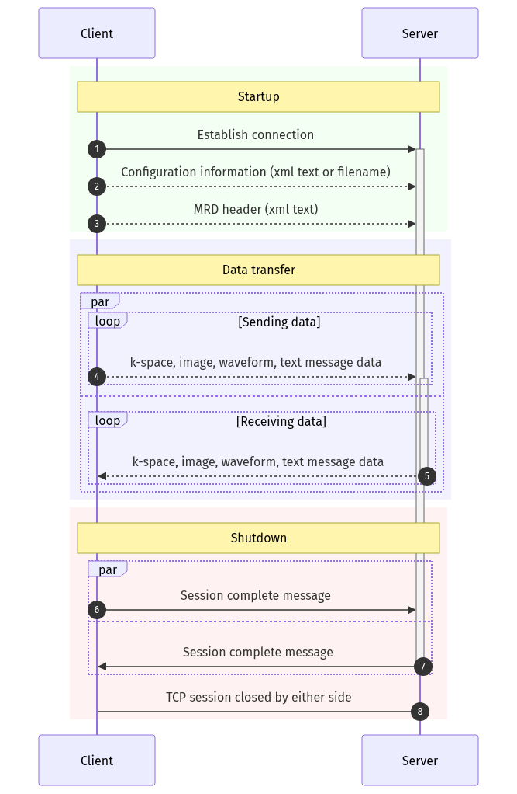

# ISMRMRD in one page

[ISMRMRD](https://ismrmrd.readthedocs.io) (MRD, for *MR Raw Data*) is the
vendor-neutral format for raw MR data and the streaming protocol that carries
it. Pulseq describes what the scanner plays; MRD describes what comes back,
and how it reaches the reconstruction. This page is a recap of the
[official documentation](https://ismrmrd.readthedocs.io/en/latest/), kept to
the parts a Pulserver user meets; how Pulserver produces an MRD stream from a
vendor scanner, and reconstructs it, is the subject of
{doc}`../sequence_model/mrd_architecture`.

## The header, and the encoding space

An MRD dataset opens with an XML header carrying everything constant for the
acquisition: sequence parameters (TR, TE, TI, flip angle), system and patient
information, and — the part reconstruction depends on — the `<encoding>`
section. It describes two spaces:

- the **encoded space**: the matrix and field of view the data are *acquired*
  on, including everything the acquisition does that the image will not show —
  readout oversampling, phase oversampling, partial Fourier;
- the **recon space**: the matrix and field of view the reconstructed image
  is expected to have.

Alongside them, the **encoding limits** say how far each encoding counter
actually runs and where its centre (k-space centre) sits. The official
documentation's own example makes the idea concrete: a Cartesian acquisition
with two-fold readout oversampling (encoded matrix and FOV twice the recon
ones along `x`), and along the first phase-encoding dimension a combination
of 20 % oversampling, reduced phase resolution and partial Fourier, expressed
purely through the limits:

```text
0                                     70                                         139
|-------------------------------------|-------------------------------------------|
                        ****************************************************
                        ^               ^                                  ^
                        0              28                                  83
```

The encoded grid runs 0–139 with its centre at 70; the acquired lines are
0–83 with their centre at 28. Placing the acquired lines so that their centre
lands on the grid centre reproduces the sampling pattern — asymmetric because
of partial Fourier — with no further convention needed. (Diagram and example
from the [MRD Header](https://ismrmrd.readthedocs.io/en/latest/mrd_header.html)
documentation.)

The readout direction deliberately has no centre in the header: sequences may
move the echo from readout to readout, so the echo position travels on each
acquisition instead. A dataset can declare several encoding spaces, and each
acquisition says which one it belongs to. Site- or sequence-specific
parameters that have no dedicated field ride in a `<userParameters>` list of
named values.

## The data messages

**Acquisitions** are the readouts. Each carries a fixed-size header plus
complex samples shaped `(coils, samples)`, and optionally the k-space
trajectory for those samples. The header holds:

- `idx` — the encoding counters: `kspace_encode_step_1` (in-plane phase
  encode), `kspace_encode_step_2` (partition), `slice`, `contrast`,
  `repetition`, `average`, `set`, `segment`, `phase`;
- `flags` — a bit field: first/last in slice or encode step, noise
  measurement, navigator, parallel-imaging calibration, and so on;
- `center_sample`, `discard_pre`, `discard_post` — where the echo sits in the
  readout, and what to trim;
- `position`, `read_dir`, `phase_dir`, `slice_dir` — the geometry that turns
  counters into physical space.

**Waveforms** are uniformly sampled, non-image data with their own id,
sampling interval and time stamp — physiological traces (ECG, respiration,
pulse oximetry) or anything a site defines.

**Images** close the loop: the reconstruction sends images back with their
own header and free-form meta-attributes.

## The session protocol

The streaming form is what a reconstruction service actually sees: a framed
message exchange over a TCP socket between a client (the data producer) and a
server (the reconstruction).

1. The client connects and sends a **configuration** message — the name of a
   configuration file on the server, or the configuration itself as XML text —
   selecting the analysis to run.
2. It sends the **MRD header** as XML text.
3. It streams **acquisitions, images, waveforms and text messages** as they
   are produced; each data type arrives in acquisition-time order, though
   messages of different types may interleave. From this point the server may
   stream data back the same way.
4. When done, the client sends a **close** message; the server sends its own
   close once it has flushed everything; either side then closes the socket.



*The MRD session protocol, reproduced from the
[Session Protocol](https://ismrmrd.readthedocs.io/en/latest/mrd_streaming_protocol.html)
page of the ISMRMRD documentation.*

Each message is length-prefixed and typed, so a service can consume a scan it
never sees the end of — reconstructing while the acquisition continues. This
is the shape Gadgetron and the Python MRD services expect, and the shape
Pulserver's reconstruction side speaks.
