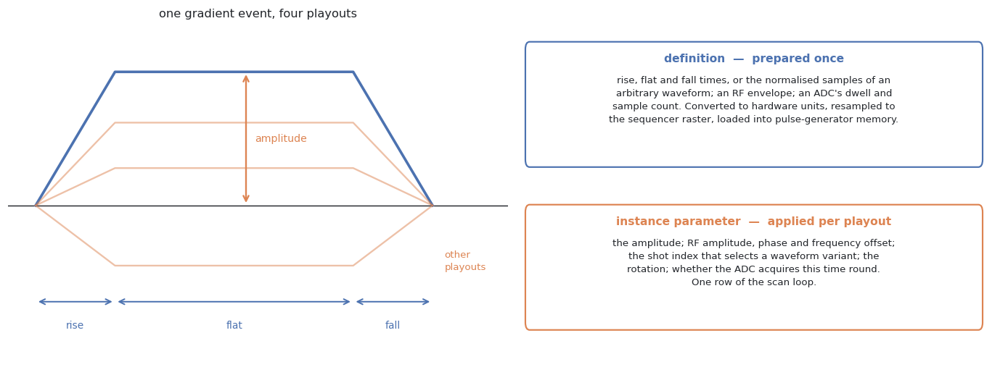
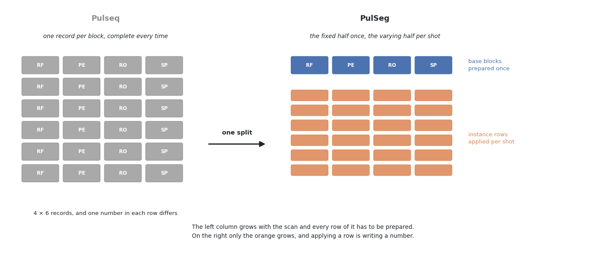

# PulSeg in one page

Pulseq describes a sequence as a flat list of blocks whose events carry
hardware-facing quantities — amplitudes in Hz and Hz/m, times on declared
rasters. What it does not describe is *structure*: nothing in the file says
which properties of an event are fixed and which vary shot to shot, which
blocks are the same block played differently, or which runs of blocks are
reusable units.

Those distinctions are what an interpreter needs, and they are what the
**PulSeg intermediate representation** (spec v2.1-alpha, J-F Nielsen and
M. Cencini) adds. This page is the published model.

## Static and dynamic, separated

The central move. In Pulseq an event is one record: a phase encode written
128 times is 128 records that differ in one number. PulSeg splits every event
into

- a **definition** — the part fixed for the whole scan: the normalized
  waveform shape, a trapezoid's rise/flat/fall times, an ADC's sample count
  and dwell, an RF pulse's envelope; and
- an **instance parameter** — the part that varies per playout: the gradient
  amplitude, the RF amplitude, phase and frequency offsets, the shot index
  that selects a waveform variant, the rotation.

An interpreter cares about this split because the two halves have different
costs. A definition is *prepared*: converted to hardware units, resampled to
the sequencer's raster, loaded into pulse-generator memory — expensive, and
done once. An instance parameter is *applied*: written into a scan-loop row —
cheap, and done a million times. Without the split every block is prepared
from scratch, and a 30-minute protocol does not fit in the time or the memory
a scanner has.

## Base blocks: the functional relationship between events

A **base block** is the definition-level identity of a block: the tuple of
event definitions it plays and its duration. Two blocks share a base block
when they play the same definitions — whatever their amplitudes.

This is more than deduplication. It states that the events of a block belong
together *as a unit*: a slice-selective excitation is its RF envelope and its
selection gradient, and the relationship between them — the pulse sits inside
the plateau, the rephaser follows the lobe — is a property of the base block,
not of any one instance. An interpreter that prepares a base block prepares
that relationship once, and every instance inherits it.

Pulseq has no such object. Its libraries deduplicate *events* independently;
the block is only the row that names them, and nothing records that the same
combination recurs.

## Virtual segments: reusable ordered groups

A **virtual segment** is an ordered list of base blocks that is played as a
unit, repeatedly. It is the granularity a real-time sequencer executes: the
segment is instantiated once in the hardware's instruction memory, then
triggered with per-instance parameters.

The specification's requirement on a segment is exactly what makes that safe —
every instance of a segment must have the same block count and the same
normalized structure, so the hardware program is valid for all of them. What
varies between instances is what the instance table carries.

## The top-level structures

The specification's top level is small:

| | |
|---|---|
| `BaseBlock` | one block's definitions and duration |
| `VirtualSegment` | an ordered list of base block ids |
| `SegmentInstance` | the per-playout parameters: amplitudes, offsets, shot index, rotation, labels |
| `ExecutionStream` | which segment instance plays when |

A Pulseq file is recovered from this by filling the definitions back in and
applying the instance parameters; the representation is lossless with respect
to what plays.

## The one thing the designer must still supply

The specification recovers these structures from a Pulseq file, but not
automatically: segment boundaries are **declared**, by the sequence designer,
through a `TRID` label — an annotation placed on the first block of each
repeating unit. The segmentation is manual. A file written without the
labels, or with labels that do not match the blocks as they now stand,
cannot be segmented as specified, and every existing Pulseq sequence has to
be annotated before it can benefit.
