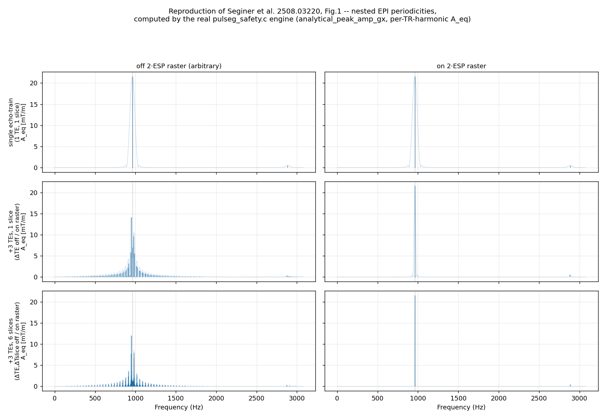
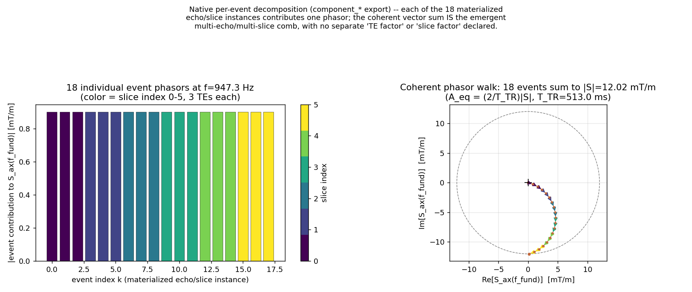
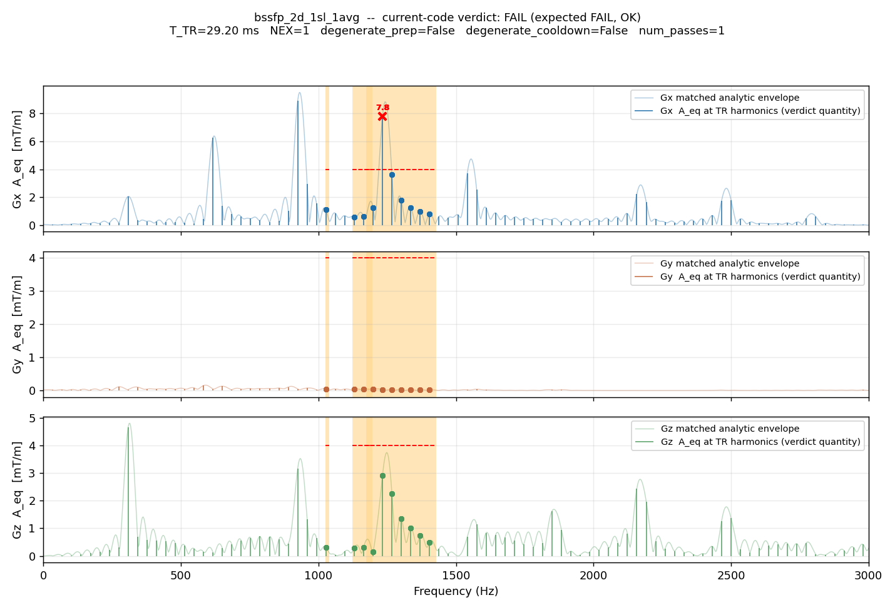
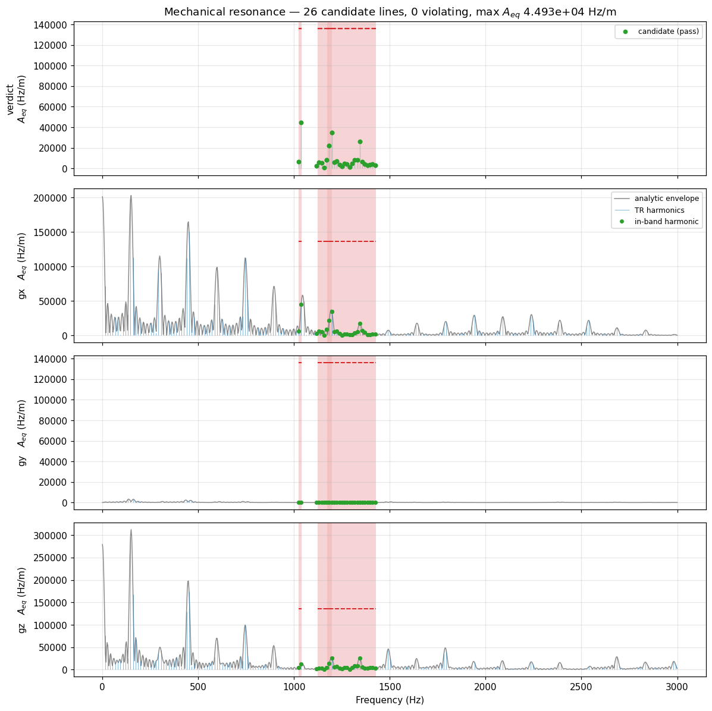

# Mechanical resonance

## The physical problem

A gradient coil sits in a strong static field. Driving current through it
produces a Lorentz force, so every gradient waveform is also a mechanical
drive on a large, stiff, lightly damped structure — the coil former, the
cryostat, the bore. That structure has resonances, and a drive that lands on
one is amplified by the structure's Q factor rather than merely transmitted.
The consequences run from unpleasant acoustic noise, through image artefacts
from bore vibration, to fatigue damage of the gradient assembly.

Vendors therefore publish **forbidden bands**: frequency ranges in which the
oscillating gradient amplitude must stay below a stated limit. The question a
sequence has to answer before it is allowed to run is narrow and specific:

> At the frequencies inside a forbidden band, how much oscillating gradient
> amplitude does this sequence actually deliver?

Note what the question is *not*. It is not "how much acoustic energy is
produced", and it is not a broadband noise figure. The forbidden band is a
statement about a resonance, and a resonance responds to coherent drive at its
own frequency. So the quantity that matters is the amplitude of the sinusoid
the sequence effectively presents at that frequency.

## The naive algorithm

Render the whole sequence to a gradient waveform, one sample per raster tick,
per axis. Take an FFT. Look at the bins inside each forbidden band. Compare
against the limit.

This is correct, and it is what any offline check would do. It has three
problems on a scanner.

**Cost.** A scan runs for minutes at a 4 µs raster: tens of millions of
samples per axis. The check runs at predownload, while the operator waits.

**Windowing.** A single FFT of a minutes-long record has microhertz
resolution and no meaningful notion of "the amplitude at 1150 Hz" — the answer
depends entirely on the window you choose, and a spectrogram's answer depends
on the window width you happened to pick. There is no principled window width,
because the sequence's own structure supplies the timescale, not the analyst.

**Truncation.** The record you transform is the scan you happened to
prescribe. Half as many repetitions gives a different spectrum for the same
physical drive, which makes the verdict depend on scan length rather than on
what the gradient coil experiences per unit time.

## What Pulserver computes instead

The analysis never renders a waveform. It exploits two exact properties of the
Fourier transform, and the fact that a Pulseq sequence is *already* written in
the form those properties want.

**Linearity.** The transform of a sum is the sum of the transforms. A sequence
is a sum of time-shifted, amplitude-scaled copies of a small library of block
shapes.

**The shift theorem.** Delaying a waveform by $t_k$ multiplies its transform
by $e^{-j2\pi f t_k}$ and changes nothing else.

Together: transform each *unique* block shape once, then get every occurrence
of it for free. Occurrence $k$, with signed amplitude $A_k$, starting at $t_k$,
contributes

$$a_k(f) = A_k\, W_k(f)\, e^{-j2\pi f t_k}$$

and the per-axis spectrum is the coherent complex sum $S_\text{ax}(f) = \sum_k
a_k(f)$. This is not an approximation traded for speed — it is algebraically
the same number the concatenated-waveform transform would give, reached by not
redoing work the mathematics says is redundant.

The verdict statistic is

$$A_\text{eq}(f) \;=\; \frac{2}{T_\text{TR}}\,\bigl|S_\text{ax}(f)\bigr| \qquad\text{[Hz/m]},$$

the amplitude of the pure sinusoid that would deliver the same coherent drive
at $f$ — a real gradient amplitude in the same units as the vendor's limit,
not a normalised score.

### Stage 1 — the canonical structural window

Everything is computed over **one canonical window**, the unit that repeats.

- **Degenerate prep/cooldown** (absent, or structurally identical to the
  repeating body): the window is **one imaging TR**.
- **Non-degenerate prep/cooldown** (a magnetisation preparation, a spoiler
  tail — a region structurally unlike the body): the window is the **whole
  pass**, prep + all NEX repeats of the body + cooldown.

Each gradient event in the window is recorded with its definition id, its
start time within the window, and its **per-position worst-case signed
amplitude** across every physical TR instance of that block position. A
phase-encode blip that takes $\{-5, 1, 0, 1\}$ across instances is stored as
$-5$: the largest magnitude, with its sign kept, so opposite-polarity
instances of one definition still contribute the correct phase. The window is
therefore *virtual* — no single TR of the real scan looks like it — and
deliberately worst-case.

### Stage 2 — per-definition waveform response

Each gradient definition's normalised complex response $W_k(f)$, with
$W_k(0)=1$, comes from its true shape:

- **Trapezoid, extended trapezoid, ramp**: the exact analytic transform of the
  piecewise-linear vertex sequence.
- **Arbitrary waveforms**: the exact transform of the raw sample sequence,
  cell-centred at $t_m = t_\text{start} + (m+\tfrac12)\Delta t$, evaluated
  directly at each query frequency.

No peak-anchoring, no magnitude-only model, no resampling.

### Stage 3 — coherent sum, with repeats folded

Where a definition repeats identically at even spacing, the shift-theorem
phase factors form a geometric series with a closed form — the Dirichlet
kernel:

$$D_N(f,T) = \sum_{n=0}^{N-1} e^{-j2\pi f n T}
= e^{-j(N-1)\pi fT}\,\frac{\sin(N\pi fT)}{\sin(\pi fT)},\qquad D_1 \equiv 1$$

so

$$S_\text{ax}(f) = \sum_k a_k(f)\, D_{N_k}(f, T_k).$$

Only NEX is folded this way. **No inner periodicity is ever declared.** An
echo train's spacing, a multi-slice repeat, a segmented readout — each
instance is simply one more materialised event inside the window, and the comb
structure *emerges* from the coherent sum, because a sum of $N$ identical
equally-spaced phasors is algebraically the Dirichlet kernel whether you write
the closed form or accumulate it term by term. The engine can therefore export
the individual per-event phasors that make up a line, which a closed-form
product model cannot.

### Stage 4 — the evaluation grid

The canonical window itself repeats $M$ times (`num_instances` — further
imaging TRs, or further passes). That repetition is folded analytically, by
its **actual finite count**, using the Dirichlet ratio

$$\text{ratio}(f) = \frac{|D_M(x)|}{M}, \qquad x = f\,T_\text{TR}, \qquad
D_M(x) = \frac{\sin(M\pi x)}{\sin(\pi x)}$$

which is exactly 1 at integer $x$. Folding by the true $M$ rather than
assuming an infinite comb is what makes the verdict *invariant to how the
sequence was authored*: $N$ identical blocks materialised inside one window,
versus one block repeated $N$ times as the outer count, are the same physical
drive and now get the same answer.

Frequencies are therefore checked at:

- every **exact TR harmonic** $f = k/T_\text{TR}$ inside a guarded band, and
- a small fixed number of **fractional frequencies** between consecutive
  harmonics, geometrically spaced near each adjacent harmonic, where the
  Dirichlet sidelobes live for large $M$ (the largest sidelobe sits within
  $\sim 1/(2M)$ of its lobe, so uniform spacing across the interval misses
  them once $M$ grows).

$S_\text{ax}(f)$ is evaluated fresh at each fractional frequency. Scaling a
harmonic's value by $\text{ratio}(f) \le 1$ would be a no-op: a scaled-down
value can never expose a candidate the harmonic did not already show.

### Candidate selection and the violation rule

The two-stage structure matters, and it is worth being explicit about why
there are two stages rather than one.

**Stage A — which frequencies are worth checking at all.** A forbidden band
arrives as $(f_\text{lo}, f_\text{hi}, \text{limit})$, but the true width of
the underlying mechanical resonance is not known — only that the vendor drew
the band about as narrow as their sharpest resonance. So every band is widened
symmetrically by a **guard**:

$$\text{guard} = \tfrac12\min(\text{band widths}),$$

half the width of the *narrowest* active band, used as the shared selectivity
estimate for all of them. Wider bands are keep-out ranges and are scanned at
the same guard. Every evaluation frequency landing in $[f_\text{lo}-
\text{guard},\ f_\text{hi}+\text{guard}]$ becomes a **candidate**. This stage
is deliberately generous: it costs one spectral evaluation to be wrong, and
missing a line here is unrecoverable.

**Stage B — whether a candidate is actually a violation.** For each candidate,
on each axis independently:

$$A_\text{eq}(f) > \varepsilon_\text{band},\qquad
\varepsilon_\text{band} = \max(\text{band limit},\ 0.08\cdot G_\text{max}).$$

The floor at $0.08\,G_\text{max}$ scales with the hardware and absorbs
incidental spectral leakage — a phase-encode blip's tail landing near a band
edge — independently of how tight a particular band limit happens to be. A
vendor band with a limit of exactly zero would otherwise reject every sequence
that puts any energy anywhere near it.

Crucially **the same statistic does both jobs**. The amplitude compared
against the limit is exactly the amplitude used to decide the frequency was
worth considering. A design where selection and verdict use different
quantities can disagree with itself by construction.

### Why this is rotation-invariant for free

Forbidden bands carry no axis tag, and the violation loop runs every axis
against every band. A per-block rotation or an oblique FOV prescription only
redistributes a fixed vector of gradient strength among Gx, Gy and Gz; it
preserves the magnitude at every frequency. So no sequence can hide a
dangerous frequency by rotating it onto an axis the check is not watching —
all three are watched, and whichever channel ends up carrying the energy is
the one whose $A_\text{eq}$ is compared.

## What this looks like on real sequences

The table below is the shipped example zoo, analysed by the same compiled
engine predownload runs, against a real vendor ESP lockout table. Each is a
one-slice, one-average protocol; the analysis cost depends on the complexity
of one canonical window, not on how many TRs follow it, so these numbers do
not change when the protocol grows to clinical size.

| Sequence | $T_\text{TR}$ | Window | Candidates | Peak $A_\text{eq}$ | Gate | Verdict |
| --- | ---: | --- | ---: | ---: | ---: | --- |
| GRE | 250 ms | 8 blocks, degenerate prep | 183 | 0.29 mT/m | 25 ms | PASS |
| FSE, ETL 16 | 3000 ms | 69 blocks, degenerate prep | 2208 | 0.74 mT/m | 785 ms | PASS |
| bSSFP | 129 ms | 129 blocks, **non-degenerate** prep | 95 | 17.5 mT/m | 41 ms | PASS |
| MPRAGE | 2163 ms | 59 blocks, degenerate prep | 1594 | 0.16 mT/m | 360 ms | PASS |
| Spiral, 48 short shots | 960 ms | 289 blocks | 708 | 2.5 mT/m | 377 ms | PASS |
| Spiral, 4 long shots | 80 ms | 25 blocks | 57 | 10.2 mT/m | 83 ms | **FAIL** |

Reproduce with `python docs/_bench/bench_safety.py --esp <table>`.

Two things in that table carry the argument.

**The spiral pair is the whole point of the criterion.** Both rows are the
same plugin, the same matrix, the same trajectory family — only the shot count
differs, and with it the readout length. The 48-shot version spreads its
gradient oscillation across many short readouts and passes comfortably. The
4-shot version concentrates it into long readouts whose fundamental lands
inside a forbidden band, and fails on Gx at 1150 Hz with
132 kHz/m against a limit of 123 kHz/m. Nothing about the *peak gradient
amplitude* distinguishes them; nothing about total acoustic energy does
either. What distinguishes them is coherent drive at one frequency, which is
exactly what $A_\text{eq}$ measures.

**bSSFP has the largest $A_\text{eq}$ in the table and still passes.** A
sustained balanced readout drives its TR fundamental hard — 17.5 mT/m of
equivalent sinusoid — but that fundamental does not land in a band on this
system. Amplitude alone is not the verdict; amplitude *at a forbidden
frequency* is. This is also the sequence family most sensitive to the band
table: shift the TR and the fundamental walks across the frequency axis.

## Computational efficiency

Cost depends on the complexity of one canonical window. It does not depend on
sequence duration, on the number of TRs, or on the number of passes.

Three quantities matter:

- **$D$ — unique gradient definitions in the window.** Small even for a
  complex window: a handful of distinct shapes. Amortised to $O(1)$ per
  occurrence by the transform cache below.
- **$M$ — outer repeat count.** Runtime is **independent of $M$**. The number
  of exact harmonics in a guarded band never scaled with $M$, and the
  finite-$M$ fold adds a fixed number of extra samples per harmonic, not a
  growing one.
- **$N$ — materialised instances of one definition inside the window.** This
  is the Stage 3 sum length, not $M$. One scale-and-phase accumulate each,
  against the memoised base transform.

The mechanics that get there:

- **Per-definition memoisation.** $W_k(f)$ is cached per `(def_id,
  frequency)` for the duration of one spectrum evaluation
  (`sa_transform_cache` in `pulseg_safety.c`). Occurrences sharing a
  definition hit the cache instead of repeating the $O(\text{vertices})$
  integral — which is what makes the extra fractional-frequency samples
  affordable.
- **Analytic evaluation.** $N_f$ frequencies over $K$ events costs
  $O(N_f \cdot K)$, with memoisation collapsing the effective $K$ toward $D$.
  No waveform is ever built for the verdict.
- **NEX is $O(1)$ per event**, via the Dirichlet kernel rather than physical
  enumeration.
- **Display-only extras are never paid for by the gate.** Two dense arrays
  exist for plotting — an FFT of the physically NEX-expanded waveform
  (`spectrum_full_g{x,y,z}`) and a dense analytic envelope
  (`envelope_amp_g{x,y,z}`) — and both are computed only by
  `pulseg_calc_mech_resonances`. `pulseg_check_safety`, the path predownload
  runs, always passes `compute_dense_envelope=0`.

The table above shows the scaling directly: FSE has 69 blocks in its window
and costs 785 ms; GRE has 8 and costs 25 ms. What the table does *not* show is
any dependence on scan length — GRE at 64 TRs and GRE at 8192 TRs have the
same window and the same cost.

For contrast, [the PNS check](pns_safety.md) is the opposite shape of problem:
it needs a materialised time-domain waveform and so does scale with the window's
*duration*, at roughly 25× the cost of this analysis on the same sequences.

## Relation to Seginer et al. 2508.03220

Seginer et al. model a multi-echo, multi-slice EPI gradient train as an
explicit convolution of a single echo train with Dirac combs at the echo,
slice and TR periods, and derive its transform as the single-train envelope
multiplied by one closed-form sine-ratio factor per nested periodicity:

$$|g(\omega)| \approx |A_n(\omega_\text{2ESP})|\cdot
\underbrace{|\text{sinc}(\cdots)|}_{\text{envelope}}\cdot
\underbrace{\left|\frac{\sin(\omega\,\Delta T_E N_\text{TE}/2)}{\sin(\omega\,\Delta T_E/2)}\right|}_{\text{TE comb}}\cdot
\underbrace{\left|\frac{\sin(\omega\,\Delta T_\text{slice} N_\text{slice}/2)}{\sin(\omega\,\Delta T_\text{slice}/2)}\right|}_{\text{slice comb}}\cdot(\cdots T_\text{R}\cdots)$$

Stage 3's coherent sum is the same physics with the nesting left implicit:
every echo and every slice instance is one materialised event, and the combs
emerge from the sum. The outermost repetition (Stage 4) is the single
exception, folded analytically by its finite count.

`mechres_plots/epi_seginer_reproduction.py` reproduces the paper's Fig. 1 — a
multi-echo multi-slice EPI train, echo spacing 0.52 ms, ETL 54, 3 TEs,
6 slices — through the real C engine, with the TE and slice spacing on and off
the $2\cdot\text{ESP}$ raster:

As in the paper, on-raster spacing keeps the energy in one dominant peak no
matter how many echoes or slices are added (the three right-hand panels have
identical peak height), while a sub-millisecond off-raster shift spreads it
into a comb of comparable peaks. Because every instance is a real event, the
engine can also export the phasors that sum to a line:

At the comb peak all 18 materialised events (3 TEs × 6 slices) add almost
perfectly in phase. There is no "TE factor" or "slice factor" anywhere in the
C code — only 18 event phasors and a running complex sum.

## Reading the plots

`mechres_plots/aeq_current.py` drives the same compiled engine across a
reference corpus. Two representative panels:

**bSSFP**, whose sustained balanced readout drives the TR fundamental hardest:

**MPRAGE**, annotated with its window parameters read from the C structure
descriptor:

In both: dark stems are $A_\text{eq}$ at exact TR harmonics — stems rather
than a line, because there is genuinely no content between them. The faint
curve underneath is the matched analytic envelope: the same closed-form
$S_\text{ax}(f)$, evaluated on a dense uniform grid. Because the stems are
that function sampled at the harmonics, the envelope passes exactly through
every stem tip with no rescaling — unlike an independent FFT of the
materialised waveform, which uses a different window and normalisation and
would only be shape-similar. Shaded regions are forbidden bands, the dashed
line is $\varepsilon$ for that band, dots are guarded-band candidates, and a
red X is a violation.
