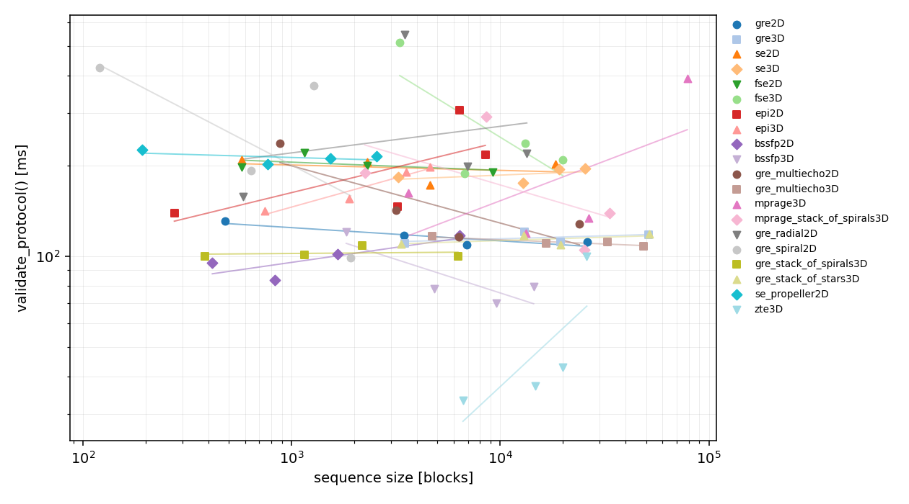
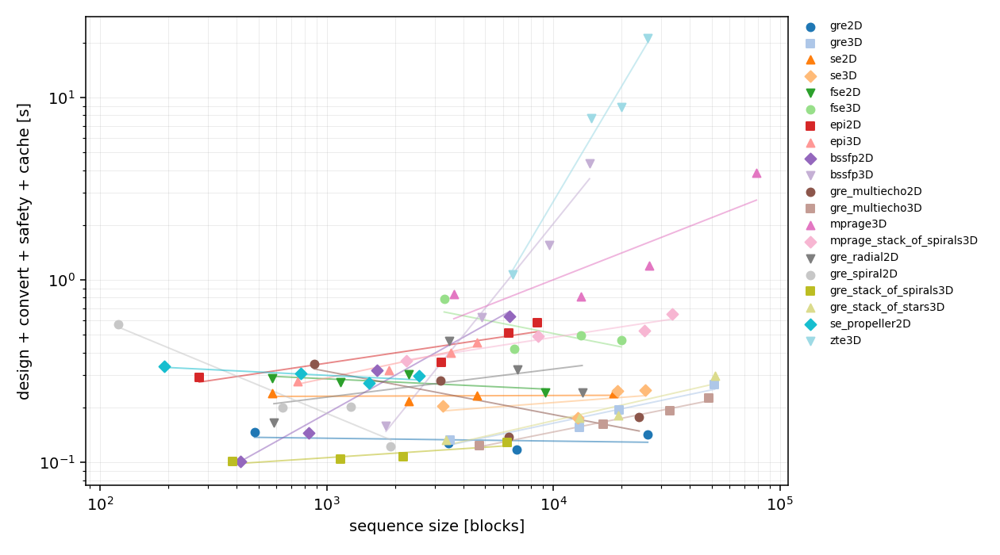
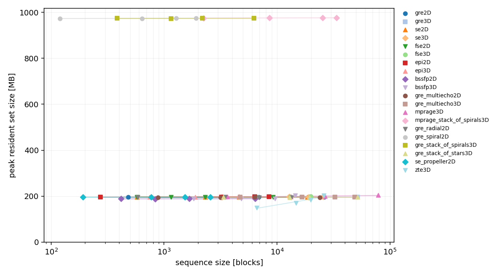
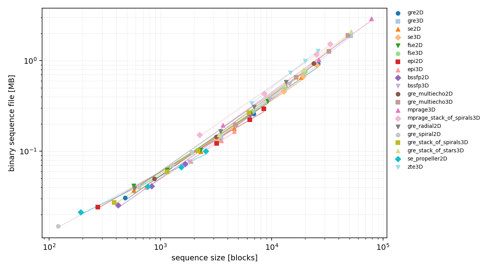
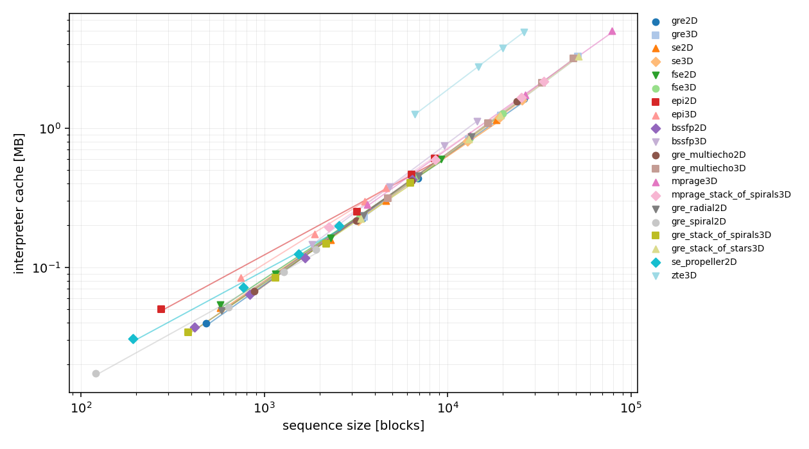

# Full benchmark

The pages before this one isolate one stage at a time, on two scale cases
chosen to make that stage's cost model visible. This one does the opposite:
every shipped plugin, at four sizes each, measured through the two entry
points a console actually calls, with nothing separated out.

The x axis of every chart is the same — the size of the scan in blocks — and
every family has its own colour, with a fitted guide through its four points.
Both axes are logarithmic and the guides are fitted in log space, so a
straight line is a power law: slope one is a cost proportional to the scan,
slope zero a cost that does not see it.

## What is measured

Two clocks, because an operator feels two.

`validate_protocol()`
: Runs on every parameter the operator touches. It re-derives the sequence's
  timing far enough to answer *is this feasible, and how long will it take*,
  and the console waits for it before it will redraw. This is the number that
  decides whether the UI feels immediate.

*Save Rx*
: Everything one press costs, end to end and in one process:
  `make_sequence` — the design loop, deduplication, and the binary write —
  then the interpreter's `pulseg_read`, which parses, converts, and writes the
  binary cache beside the file, then `pulseg_check_safety` over the canonical
  TR. Its peak resident set size is the memory the scanner host has to find,
  and the two files it leaves behind are what the host has to store.

## How

A size is a *protocol*: the plugin's own default with the prescribed
quantities overridden, exactly as the console would send it. Every case runs
in its own subprocess, so a peak RSS is that case's and not the high-water
mark of the sweep, and the reported `validate_protocol` time is the fastest of
seven calls in a warm process — the state a scanner-side plugin server is in,
and the estimate least contaminated by everything else on the machine.

System limits are the defaults, 40 mT/m and 170 T/m/s. The safety gate is
given two forbidden bands at 550–650 and 1100–1250 Hz — a band table is what
sets the resolution and the analysis range the spectral work runs at — with
the amplitude limit left wide open and the PNS ceiling likewise, so every case
runs the whole check instead of returning early on a verdict. The gate's
*cost* is what this page reports; its *verdicts* are {doc}`../safety/index`.

## Protocol validation



## Save Rx, end to end



## Peak memory



## The two files





## Reproducing it

```bash
python docs/_bench/bench_full.py                 # the whole sweep
python docs/_bench/bench_full.py --only=gre2D    # one family
python docs/_bench/bench_full.py --figures-only  # redraw from the JSON
```

Measured on the tree this documentation was built from, single core. Re-measure
rather than quote them when the question is whether a change made something
slower.
