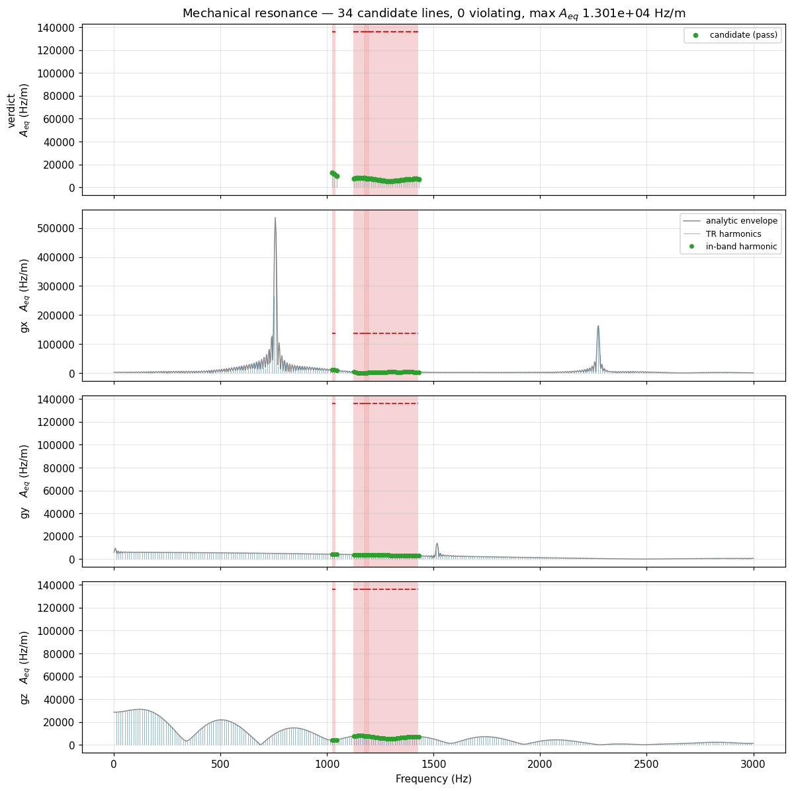

# Mechanical resonance

{doc}`The verdict itself <../safety/mechanical_resonance>` asks whether a
sequence drives the magnet's structure inside a band it must not be driven in.
That is a question about a *spectrum*, and a spectrum of a scan is the one
analysis that looks least affordable: minutes of gradient waveform, Fourier
transformed, read against a band table.

It is affordable because the evaluation never renders a waveform and never
computes a whole spectrum. It computes, analytically, the spectrum of each
gradient *waveform* — once — and then evaluates the coherent sum **only at
the frequencies that actually matter**, over **one** repetition time.

## Nothing is rendered

Each gradient in the canonical TR is a piecewise-linear shape, and a
piecewise-linear shape has a closed-form transform. It is computed once per
waveform and cached under it, so an echo train that plays one blip a hundred
times hits the cache ninety-nine times. The occurrences differ by amplitude
and by time offset, which are a scale and a phase on the stored transform —
not a reason to transform anything again. A rotation is the same arithmetic
one step further out: it mixes three stored transforms in fixed proportions,
so a turned arm needs no transform of its own.

## Only the frequencies that matter

A TR played back to back with copies of itself puts energy at the harmonics of
its own period, and nowhere else. So the verdict does not need a spectrum: it
needs the harmonics $k/T_\text{TR}$ that fall inside a guarded band, and the
coherent sum evaluated at those. The band table decides how many there are,
and the complexity of one window decides what each costs.

Asking for a *picture* is a different question, and it gets a different
answer: a dense comb across the whole displayed range, computed by a chirp-z
transform.

## One TR, and every repetition of it

The saving that matters most is the last one: the analysis runs on a single
canonical TR and the verdict is taken to hold for the whole scan. That is only
sound if the instances of that TR cannot be louder than the one number the
gate judges — and they are not all the same waveform. A phase encode steps
between them; a multishot readout plays a different arm each time; a rotation
extension turns the arm without changing what is stored.

So the canonical TR is assembled position by position rather than copied from
any one repetition:

- A block position that is identical in every instance — the excitation, the
  slice select, the spoiler, an unrotated readout — enters the **coherent
  sum**, complex value and all. This is the exact calculation, and it is where
  a comb like EPI's gets its sharpness, so nothing is given away here.
- A position that **differs** between instances contributes the largest
  magnitude any of them can put there, taken over the combinations of
  waveform, amplitude and rotation that the scan really plays.

Coherence is surrendered only at the positions that have no single value to be
coherent with, and only for those positions' own contribution. What comes out
is at least what any repetition drives, at every harmonic.

That claim is visible. A four-arm spiral GRE has the most interesting
canonical TR there is — every shot is a different waveform, not a rescaled one
— and its interleaves sit under the line the gate judges, harmonic by
harmonic:

Read the level before the shape. $A_{eq}$ at the harmonics is a Fourier
series of the canonical TR, so the squares of those lines add up to the TR's
own gradient variance and nothing is hiding between them: this spiral runs
about 4 mT/m rms on each in-plane axis across its 30 ms TR, and no single
in-plane line carries more than 2.3 mT/m of it. That is what a swept readout
looks like — its drive is spread across the range it sweeps rather than piled
onto one frequency, which is what the comb at the top of this page does with
the same kind of energy. Broadband is not the same as over the limit: the
tolerance drawn here is 3 mT/m, which is 0.3 G/cm in the unit an ESP row
states, and the same order as the floor the engine anchors a zero-tolerance
row to (0.08 × $G_\text{max}$, 3.2 mT/m on this sequence's gradients). Every
arm, and the bound over them, stays under it.

The arms of a trajectory are near-copies of one another, so their spectra
nearly coincide — but *nearly* is the whole problem. Where the interleaves
separate, they separate at the harmonics, and there is no reason for the
loudest of them at a guarded frequency to be the loudest overall: an arm can
be quieter everywhere except inside the band. Choosing a representative shot
by any single number — the largest amplitude, the sharpest slew — would pick
by the wrong criterion. Bounding them position by position does not have to
choose.

## A turned arm and a written-out arm

The same spiral can reach the scanner two ways: one stored waveform with a
rotation per shot, or every arm written out as its own gradient. A scanner
plays the identical field either way, so the acoustic verdict may not depend
on which the author wrote — the rotation is carried into the analysis rather
than left in the file.

## What that costs

The same EPI protocol at four scan lengths, with the repetition held fixed:

| Blocks | TRs | Over the timeline | Gate (banded harmonics) | Display comb |
|---:|---:|---:|---:|---:|
| 297 | 3 | 21 ms | 33 ms | 6.6 ms |
| 1 188 | 12 | 80 ms | 36 ms | 6.8 ms |
| 4 752 | 48 | 311 ms | 36 ms | 7.2 ms |
| 14 256 | 144 | 1 012 ms | 36 ms | 8.5 ms |

The two right-hand columns do not move: a 3-TR scan and a 144-TR scan of the
same sequence cost the same, because they *are* the same sequence and the
verdict is a property of the repetition. The left-hand column is upstream
PyPulseq's `calc_gradient_spectrum` over the timeline — which is what `tr=None`
is, to the bit — and it grows with the scan, as a transform of the scan must.

The gate costing more than the picture is not a mistake. The comb is one
chirp-z transform at a fixed resolution; the gate evaluates the coherent sum
at every guarded harmonic, and refines each candidate with sub-points before
it will call a peak a peak. It is the more careful of the two, and it is the
one the scanner runs.

The spiral says what the bound itself costs, because there the same scan can
be handed over as one waveform or as many:

| Arms | How the arms are encoded | Distinct waveforms | Over the timeline | Gate |
|---:|---|---:|---:|---:|
| 4 | turned by a rotation | 10 | 9.7 ms | 11.7 ms |
| 4 | written out | 28 | 5.3 ms | 20.3 ms |
| 16 | turned by a rotation | 10 | 35 ms | 8.5 ms |
| 16 | written out | 100 | 15 ms | 23.2 ms |
| 64 | turned by a rotation | 10 | 135 ms | 9.8 ms |
| 64 | written out | 388 | 56 ms | 43.8 ms |

Sixteen times the arms leaves the gate where it was when they are rotations —
there is still one readout waveform, turned a different way each shot. Written out, the same
scan is 388 distinct waveforms and the gate follows them, because each one has
a transform of its own and the bound has to see all of them. That is the
honest shape of the cost: **the gate is paid per distinct waveform, never per
block and never per repetition.**

## What is still allowed to scale

The candidate harmonics are $k/T_\text{TR}$ inside a fixed-width band, so
there are exactly as many of them as the TR is long: doubling $T_\text{TR}$
doubles the work. Waveform *length* barely registers — it enters only through
the size of the transform each waveform needs, and that is computed once per
waveform rather than once per occurrence. What does register is how many
distinct waveforms a varying position can take, which is the table above, and
which is also the one number a sequence author controls: a trajectory whose
shots are one waveform under a rotation is cheaper to check than the same
trajectory written out, and reaches the same verdict.
