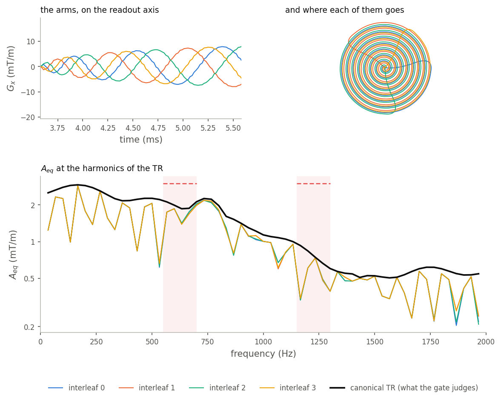
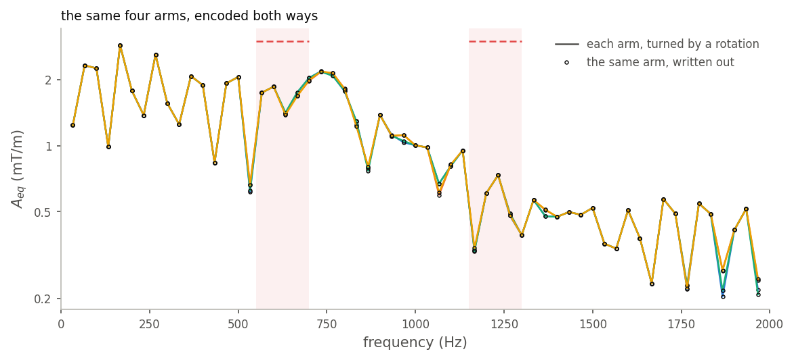

# Mechanical resonance

{doc}`The verdict itself <../safety/mechanical_resonance>` asks whether a
sequence drives the magnet's structure inside a band it must not be driven in.
That is a question about a *spectrum*, and a spectrum of a scan is the one
analysis that looks least affordable: minutes of gradient waveform, Fourier
transformed, read against a band table.

It is affordable because the evaluation never renders a waveform and never
computes a whole spectrum. It computes, analytically, the spectrum of each
gradient *waveform* — once — and then evaluates the coherent sum **only at
the frequencies that actually matter**, over **one** repetition time.

## Nothing is rendered

Each gradient in the canonical TR is a piecewise-linear shape, and a
piecewise-linear shape has a closed-form transform. It is computed once per
waveform and cached under it, so an echo train that plays one blip a hundred
times hits the cache ninety-nine times. The occurrences differ by amplitude
and by time offset, which are a scale and a phase on the stored transform —
not a reason to transform anything again. A rotation is the same arithmetic
one step further out: it mixes three stored transforms in fixed proportions,
so a turned arm needs no transform of its own.

The set of waveforms a sequence brings is therefore the thing that costs
money, and the whole strategy is to keep that set as small as the sequence
truly makes it. Call it the **basis**: the distinct gradient waveforms the
canonical TR plays, each transformed once, everything else expressed as a
scale, a delay, or a rotation of one of them.

## Three kinds of waveform, three costs

"Piecewise linear" is not a special case — it is the model. An arbitrary
gradient is samples on the gradient raster with the field interpolated
between them, so a spiral arm and a trapezoid differ only in how many
vertices they have. What changes is what each costs to transform, and
sequences fall into three regimes.

**Trapezoids, and trapezoids bridged into longer runs.** Four vertices, or a
few dozen when lobes are bridged into an extended shape. The closed form is
evaluated directly; it is too cheap to be worth any cleverness, and a
sequence built entirely from them — Cartesian gradient echo, spin echo, most
preparation — has a basis of a handful of waveforms that never grows with the
matrix, because a phase encode is the *same* trapezoid at a different
amplitude.

**One long arbitrary waveform.** A spiral, a rosette, a wave-encoding
readout: thousands of vertices, but one base shape that every shot reuses.
Evaluating the closed form point by point would cost vertices × frequencies,
and both factors are large. Instead, the frequencies the gate asks for are
not arbitrary — inside a band they are consecutive harmonics of the same TR,
probed at a fixed set of offsets, so they lie evenly spaced in angle. On such
a comb the transform reduces to one polynomial, and a chirp-z transform
produces its value at every candidate in the band at once. The same integral
of the same interpolant, in the same double precision, at
`(n + m) log(n + m)` instead of `n × m`. Below sixty-four vertices the direct
loop wins and the tabulation is skipped, so no trapezoid ever takes this
path.

**Many long arbitrary waveforms.** A trajectory whose shots are individually
optimised — a non-Cartesian 3D readout with a numerically distinct arm per
repetition — has a basis as large as its shot count, and nothing above
compresses it, because the arms genuinely are different waveforms. This is
the regime where the cost is real and where the remaining work lies; the
section on cost below says exactly what it looks like and what is left to do
about it.

The regime is discovered, never declared. Nothing in the analysis asks what
kind of sequence it is holding.

## Only the frequencies that matter

A TR played back to back with copies of itself puts energy at the harmonics of
its own period, and nowhere else. So the verdict does not need a spectrum: it
needs the harmonics $k/T_\text{TR}$ that fall inside a guarded band, and the
coherent sum evaluated at those. The band table decides how many there are,
and the complexity of one window decides what each costs.

Asking for a *picture* is a different question, and it gets a different
answer: a dense comb across the whole displayed range, computed by a chirp-z
transform.

## One TR, and every repetition of it

The saving that matters most is the last one: the analysis runs on a single
canonical TR and the verdict is taken to hold for the whole scan. That is only
sound if the instances of that TR cannot be louder than the one number the
gate judges — and they are not all the same waveform. A phase encode steps
between them; a multishot readout plays a different arm each time; a rotation
extension turns the arm without changing what is stored.

So the canonical TR is assembled position by position rather than copied from
any one repetition:

- A block position that is identical in every instance — the excitation, the
  slice select, the spoiler, an unrotated readout — enters the **coherent
  sum**, complex value and all. This is the exact calculation, and it is where
  a comb like EPI's gets its sharpness, so nothing is given away here.
- A position that **differs** between instances contributes the largest
  magnitude any of them can put there, taken over the combinations of
  waveform, amplitude and rotation that the scan really plays.

Coherence is surrendered only at the positions that have no single value to be
coherent with, and only for those positions' own contribution. What comes out
is at least what any repetition drives, at every harmonic.

That claim is visible. A four-arm spiral GRE has the most interesting
canonical TR there is — every shot is a different waveform, not a rescaled one
— and its interleaves sit under the line the gate judges, harmonic by
harmonic:

Read the level before the shape. $A_{eq}$ at the harmonics is a Fourier
series of the canonical TR, so the squares of those lines add up to the TR's
own gradient variance and nothing is hiding between them: this spiral runs
about 4 mT/m rms on each in-plane axis across its 30 ms TR, and no single
in-plane line carries more than 2.3 mT/m of it. That is what a swept readout
looks like — its drive is spread across the range it sweeps rather than piled
onto one frequency, which is what the comb at the top of this page does with
the same kind of energy.

The arms of a trajectory are near-copies of one another, so their spectra
nearly coincide — but *nearly* is the whole problem. Where the interleaves
separate, they separate at the harmonics, and there is no reason for the
loudest of them at a guarded frequency to be the loudest overall: an arm can
be quieter everywhere except inside the band. Choosing a representative shot
by any single number — the largest amplitude, the sharpest slew — would pick
by the wrong criterion. Bounding them position by position does not have to
choose.

## A turned arm and a written-out arm

The same spiral can reach the scanner two ways: one stored waveform with a
rotation per shot, or every arm written out as its own gradient. A scanner
plays the identical field either way, so the acoustic verdict may not depend
on which the author wrote — the rotation is carried into the analysis rather
than left in the file.

The two encodings agree arm by arm, to within the last bits of the transform.
They do not cost the same, and that is the subject of the cost section: the
basis of the turned version is one waveform, the basis of the written-out
version is one per arm.

## Where the threshold comes from

A band table states a frequency range and, sometimes, an amplitude. It does
not state what makes that range dangerous, what the resonance's quality
factor is, or how the amplitude was arrived at — and a great many bands state
no amplitude at all, which reads as *zero tolerance*.

Zero cannot be taken literally, and not for a subtle reason: a periodic
gradient has lines at every harmonic of its own period, and any real band is
far wider than that spacing, so **every band contains lines of every sequence,
always**. Sweeping a hundred-hertz band across the whole audio range for every
shipped plugin, there is not one placement with no line inside it and not one
line that is exactly zero. A literal reading refuses everything ever written,
and almost all of those refusals would be a sequence whose in-band content is
a tenth of a mT/m — real, and utterly harmless. The weak content is not an
artefact to be filtered away; it is genuinely there, and it is small. What is
needed is a number that says *how* small stops mattering, and that number is
nowhere in the table.

So it was calibrated, against the only evidence that exists: the vendor's own
product sequences. Some sequence families ship with a frequency lockout on
them and some do not, and where a lockout exists it is enforced by steering a
parameter — a readout spacing, a repetition time — away from the band rather
than by refusing the scan. Which families those are, and what each steers, is
the vendor's business and is not reproduced here; what the calibration needs
from that inspection is one thing, and it is a threshold.

The inspection was turned into a measurement. Every shipped plugin was
designed at protocols a console could plausibly prescribe, on more than one
set of system limits, and the equivalent sustained amplitude each one puts
inside the frequency range where vendor bands actually fall was measured the
way the gate measures it:

The corpus separates, and it separates with a gap. Everything loud is a
sustained comb — a readout train, or a repetition period short enough that
the TR harmonic itself lands in the audio range — and everything quiet is
either broadband or slow. The sequences that resemble the ones a vendor puts
a lockout on sit above 8.9 mT/m; the sequences that resemble the ones a
vendor leaves alone top out at 6.1. The threshold is placed in that gap, at
**7.5 mT/m of equivalent sustained amplitude**, and the corpus is bimodal
enough that anywhere in the gap gives the same verdicts.

Two things about that number are worth stating plainly. It is a policy, not a
physical constant, and it is ours rather than a vendor's — the code says so
where it is defined, so nobody has to reverse-engineer whose authority it
carries. And it is *below* the thresholds implied by the bands that do state
an amplitude, which is the right order: a band that forbids a readout outright
is making a stricter statement than a band that permits one up to a level.

A band that states an amplitude keeps it. That amplitude describes the
plateau of a readout train, while the measurement is an equivalent sinusoid,
so it is converted into the same convention before the comparison — over the
train shapes a system can play, the equivalent sinusoid runs between $8/\pi^2$
and $4/\pi$ of the plateau, and the smallest is taken, which makes the
threshold the quietest waveform the vendor forbade.

None of this reaches into the sequence. The gate never asks what family it is
holding, never looks for a readout spacing, and never reads a repetition time
as a parameter to be steered. It measures drive and compares it to a level.
A gradient-echo sequence whose readouts are made bipolar and numerous enough
becomes an echo-planar train in everything but name, and is refused on exactly
the same arithmetic that refuses an EPI — its comb appears at the frequency
its echo spacing implies, and grows with the length of the train, with nothing
anywhere in the engine that knows either term.

## What it costs

The gate's cost has three candidate drivers, and measuring against each one
separately says which of them the design actually removed:

**Scan length is nearly free.** Thirty-two repetitions and a thousand cost
0.02 ms and 0.29 ms. What little growth there is comes from the walk that
collects, per block position, the distinct waveform-amplitude-rotation
combinations the instances play — that walk visits every repetition. The
spectral evaluation itself does not: it is a property of one repetition, and
a scan of ten thousand TRs evaluates the same sum as a scan of ten.

**Basis size is the real driver, and the author controls it.** Sixty-four
spiral arms cost 0.36 ms written out and 0.04 ms as one waveform under a
rotation — the same field, the same verdict, nine times the work. Written
out, each arm has a transform of its own and the bound has to see all of
them.

| Arms | How the arms are encoded | Gate |
|---:|---|---:|
| 4 | turned by a rotation | 0.02 ms |
| 4 | written out | 0.05 ms |
| 16 | turned by a rotation | 0.02 ms |
| 16 | written out | 0.12 ms |
| 64 | turned by a rotation | 0.04 ms |
| 64 | written out | 0.36 ms |

**The number of harmonics inside a band is the other driver**, and it is the
one nobody controls. A band contains `width × T_TR` harmonics, so a long
repetition time puts hundreds of lines inside a hundred-hertz band and every
one of them costs a transform of every waveform in the basis. Two harmonics
cost 0.11 ms and thirty-two cost 1.1 ms, dead linear. This is why the
expensive sequence in the corpus is not the biggest one: a long-TR
inversion-prepared scan with spiral readouts has only a few thousand blocks
and a basis of thirteen waveforms, and it is the slowest thing measured,
because its two-second repetition puts two hundred lines in every band.

Basis size still has an answer waiting: arms that are individually
optimised are not *independent*, their span being far smaller than their
number, so a small set of basis waveforms reproduces every arm as a linear
combination — and since the transform is linear, transforming the basis
transforms all of them. That turns cost from the shot count into the rank.

The harmonic count is worth being precise about, because the obvious
simplifications are wrong. A resonance a hundred hertz wide cannot tell apart
lines half a hertz apart — it responds to the energy in its whole passband —
so the physically right quantity is the energy summed across the band rather
than its loudest line. That is a better *question*, but not a cheaper one: a
sum over the lines still needs every line.

Nor can the frequencies between the harmonics be skipped. A scan is not an
infinite repetition of its TR but a finite number of them, and a run of $M$
repeats resolves frequency only to $1/(M\,T_\text{TR})$, so real drive lives
between the harmonics of $1/T_\text{TR}$. Its shape is known exactly — the
single-TR transform times the Dirichlet kernel of $M$ — which fixes where to
look: the kernel peaks at $(k + (j + \tfrac12)/M)$ with heights
$2/\pi(2j{+}1)$, that is $0.64$, $0.21$, $0.13$, $0.09$, and so on down. The
heights do not depend on $M$; only their spacing does. Four probes a side
therefore cover every lobe above a tenth of the main one for any $M$
whatever, and the lobes are the whole of the story: sample instead at
multiples of $1/M$ and every probe lands on one of the kernel's *nulls*,
where the attenuation is zero and no number of probes reports anything.

What does cut the count is knowing when not to look at all. The drive at any
frequency is at most the area under the rectified gradient,

$$|S_\text{ax}(f)| \;\le\; \int_\text{TR} |g_\text{ax}(t)|\,dt ,$$

because the phase factor has unit modulus and integrating it away can only
shrink the result. The right-hand side does not depend on $f$, costs one pass
over the events, and across the corpus sits only $1.3$–$2\times$ above the
loudest line a full walk actually finds — close enough to be decisive rather
than vacuous. Where it already falls below a band's threshold, no line in
that band can violate, and the probes inside it are skipped as a proven
negative rather than evaluated into a measured one. Quiet sequences stop
paying for the search entirely; loud ones pay in full, which is the right way
round.

For scale, upstream PyPulseq's `calc_gradient_spectrum` over the timeline —
which is what `tr=None` is, to the bit — takes 37 ms, 66 ms, 309 ms and
907 ms on the same EPI protocol at 3, 12, 48 and 144 repetitions, growing
with the scan as a transform of the scan must, while the gate stays under
2 ms across all four.

## That the fast answer is the same answer

Every shortcut on this page is a claim that two calculations agree, and each
one is held to that by a test that computes both:

- The closed-form transform against a direct numerical Fourier integral of
  the rendered TR: they agree to eight parts in a million, and the residual
  is the reference integral's own sampling.
- The chirp-z tabulation against the direct closed-form loop, waveform by
  waveform — a reassociation of the same sum, so the two match to the last
  bits.
- The bound against every instance it stands for: for every fixture whose
  canonical TR repeats, at every guarded line and every axis, the number the
  gate judges is at least what any single repetition really drives.
- A sequence with one repetition, where nothing varies and the bound has
  nothing of its own to add, against the plain coherent sum: bit for bit
  identical, which is what keeps the bound from being a blanket margin.
- The same physical scan written with rotation events and with materialised
  arms: the same verdict, arm by arm.
- The threshold placed a hair either side of a sequence's own loudest line,
  over the shipped plugins and bands wide and narrow: the verdict flips
  exactly on the peak, which is where a ceiling that skipped too much would
  betray itself.
- The lines the plot draws against the verdict the predownload gate reaches,
  on recorded sequences, through two independent paths into the engine — a
  plot that disagreed with the gate would be worse than no plot.

The point of the list is not the tests. It is that none of the machinery
above is allowed to be an approximation of the rule on the
{doc}`safety page <../safety/mechanical_resonance>`: it is the same rule,
evaluated in an order that costs less.
