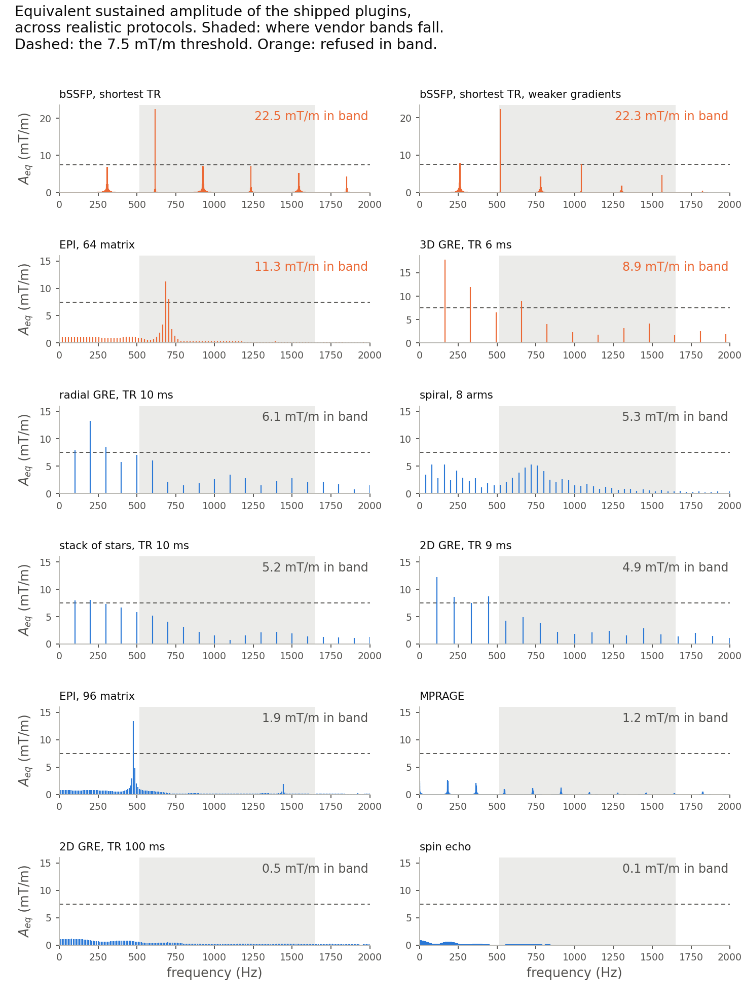
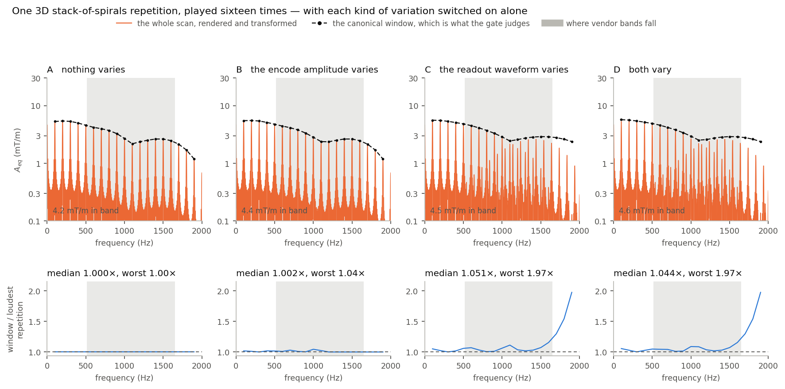
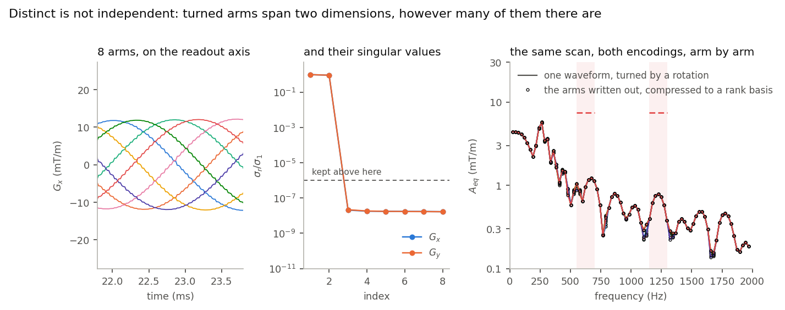
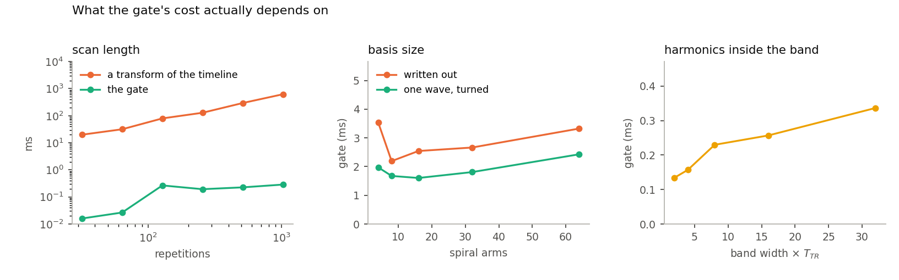
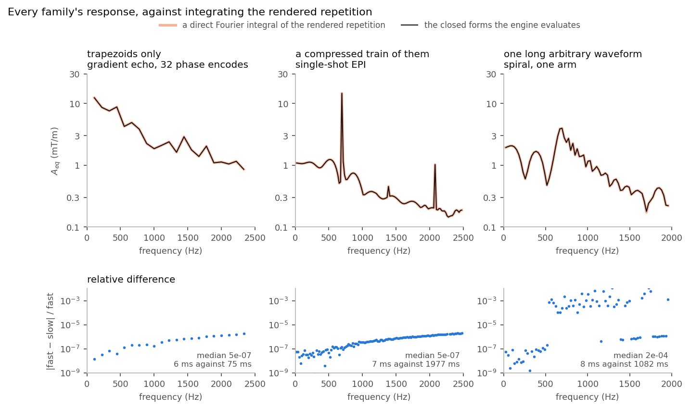
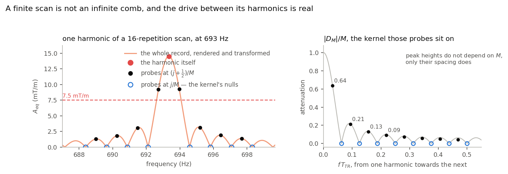
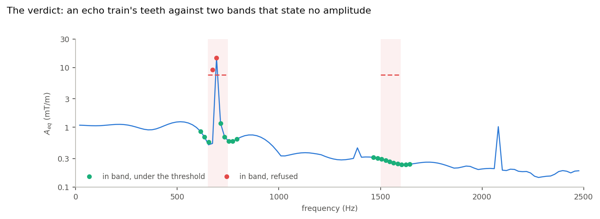

# Mechanical resonance

A gradient coil in a static field is a loudspeaker, and a magnet has mechanical
modes it must not be driven on. The {doc}`safety page <../safety/mechanical_resonance>`
sets out the physics and fixes the quantity to measure: for each axis, at each
frequency, the **equivalent sustained amplitude**

$$A_\text{eq}(f) \;=\; \frac{2}{T_\text{TR}}\bigl|S_\text{ax}(f)\bigr| ,$$

the amplitude of the pure sinusoidal gradient that would deliver the same
coherent drive at $f$, in the mT/m a vendor states its limits in.

Two things stand between that definition and a verdict.

**How much is too much.** Most published bands state a frequency range and no
amplitude, which reads as zero tolerance. Zero cannot be taken literally: a
periodic gradient has lines at every harmonic of its own period, and any real
band is far wider than that spacing, so *every band contains lines of every
sequence*. A literal reading refuses everything ever written. The number that
says how small stops mattering is nowhere in the table.

**How to compute it in the time an operator will wait.** $S_\text{ax}$ is a
transform of the scan — minutes of waveform on a microsecond raster. It has to
be evaluated at every frequency a band contains, and it has to hold for every
repetition, not just the first one.

This page settles both. Everything on it is the safety page's rule evaluated in
a cheaper order, and every shortcut is drawn against the calculation it replaces.

---

## 1. The threshold is calibrated, not derived

A band table states a range and, sometimes, an amplitude. It does not say what
makes the range dangerous, what the resonance's quality factor is, or how the
amplitude was arrived at. So the zero-tolerance threshold was measured against
the only evidence that exists: a vendor's own product sequences. Some families
ship with a frequency lockout on them and some do not, and where a lockout
exists it is enforced by steering a parameter away from the band rather than by
refusing the scan. Which families those are is the vendor's business and is not
reproduced here; what the calibration needs from that inspection is one number.

The inspection was turned into a measurement. Every shipped plugin was designed
at protocols a console could plausibly prescribe, on two sets of system limits,
and the $A_\text{eq}$ each one puts inside 515–1650 Hz — the range where every
inspected band falls — was measured the way the gate measures it:



The corpus separates, and it separates with a gap:

| loud — resembles a family a vendor puts a lockout on | in band |
|---|---:|
| bSSFP at the shortest TR, on two gradient systems | 22.5, 22.3 mT/m |
| single-shot EPI, 64 matrix | 11.3 |
| 3D gradient echo, TR 6 ms | 8.9 |

| quiet — resembles a family a vendor leaves alone | in band |
|---|---:|
| radial gradient echo, TR 10 ms | 6.1 |
| spiral 8 arms · stack of stars · 2D gradient echo, TR 9 ms | 5.3, 5.2, 4.9 |
| EPI 96 · MPRAGE · gradient echo TR 100 ms · spin echo | 1.9, 1.2, 0.5, 0.1 |

Everything in the loud group is a sustained comb — a readout train, or a
repetition period short enough that the TR harmonic itself lands in the audio
range. Everything in the quiet group is broadband or slow. The loud group
starts at 8.9 mT/m and the quiet one tops out at 6.1, so the threshold sits in
that gap, at **7.5 mT/m of equivalent sustained amplitude**. The corpus is
bimodal enough that any value in the gap gives the same verdicts.

Three things about that number are worth stating plainly.

It is a **policy, not a physical constant**, and it is ours rather than a
vendor's; the code says so where it is defined.

It is **below** the thresholds implied by the bands that *do* state an
amplitude, which is the right order — a band that forbids a readout outright is
a stricter statement than one that permits a readout up to a level.

A band that states an amplitude keeps it, converted first. That amplitude
describes the plateau of a readout train while $A_\text{eq}$ is an equivalent
sinusoid, and over the train shapes a system can play the equivalent sinusoid
runs between $8/\pi^2$ and $4/\pi$ of the plateau. The smallest is taken, so
the threshold becomes the quietest waveform the vendor forbade.

Nothing in the gate reaches into the sequence to apply this. It never asks what
family it is holding, never looks for an echo spacing, and never reads a
repetition time as a parameter to be steered. A gradient echo whose readouts are
made bipolar and numerous enough becomes an echo-planar train in everything but
name, and is refused on exactly the arithmetic that refuses an EPI.

---

## 2. What the analysis is given

A scan is $M$ repetitions of one structural TR — the smallest block period over
which the {doc}`normalized structure repeats <../sequence_model/tr_and_segmentation>`,
derived from the block content rather than annotated.

One TR is an ordered list of **base block** ids. A base block is the
definition-level identity of a block: the tuple of event *definitions* it plays
and its duration, so two blocks share one whenever they play the same
definitions, whatever amplitudes they play them at
({doc}`the PulSeg split <../background/pulseg>`). An event definition is the
part of an event that is fixed for the whole scan — its structural properties,
with the per-playout numbers held separately.

For the gradients, that leaves a TR as an ordered list of $(g_x, g_y, g_z)$
definition tuples, where each entry is one of two things:

| | identified by | plus, per playout |
|---|---|---|
| trapezoid | delay, rise, flat, fall | amplitude, rotation |
| arbitrary | delay, time shape, sample count | waveform shape, amplitude, rotation |

That table is the whole cost model. Position in the TR fixes a start time, so
the shift theorem handles *when* an event plays; a definition fixes a shape, so
one transform serves every playout of it; and amplitude and rotation are
per-playout numbers that scale and mix an answer already computed. What is left
to actually transform is the set of distinct shapes, which for a Cartesian
sequence is a handful and never grows with the matrix.

Note where the waveform shape sits in the arbitrary row. Two spiral arms written
out shot by shot have the *same* definition — same delay, same sampling, same
length — and different shapes. They are one entry in the sequence's definition
library and two distinct waveforms to this analysis, which keys on the shape as
well. Getting that wrong hands every arm the first arm's spectrum.

---

## 3. The canonical TR, and the three ways repetitions differ

The analysis runs on a single window and the verdict is taken to hold for the
scan. That is sound only if no repetition can be louder than the window — and
repetitions are not all the same waveform. Position by position, three
situations arise:

**A — nothing varies.** Excitation, slice select, spoiler, an unrotated
readout: the same definition at the same amplitude and rotation in every
repetition. These enter the **coherent sum**, complex value and all. This is
exact, and it is where a comb gets its sharpness.

**B — an amplitude or a rotation varies.** A phase encode steps; a radial or
spiral shot is turned by a rotation extension. One waveform, several
$(\text{amplitude}, \text{rotation})$ combinations. The position contributes the
largest magnitude over the combinations the scan really plays — not over an
envelope of them, over the real list.

**C — the waveform varies.** A multishot readout written out shot by shot, a
sparkling trajectory: different shapes at the same position. Same rule, over the
distinct (shape, amplitude, rotation) tuples the position actually takes.

In B and C, coherence within the position is given up because there is no single
value to be coherent with; everything else in the TR keeps it. The result is at
least what any repetition drives, at every harmonic and on every axis — which
is a claim you can look at:



Case A costs nothing: the window *is* the repetition, ratio 1.000 at every line.
Where something varies the window is 1.2× the loudest repetition on the median
line, and never below it. That is the whole price of not transforming the scan.

Bounding position by position also avoids a choice that cannot be made well. The
arms of a trajectory are near-copies, so their spectra nearly coincide, and
where they separate they separate at the harmonics. There is no reason the
loudest arm at a guarded frequency should be the loudest arm overall — one can
be quieter everywhere except inside the band. Picking a representative shot by
its peak amplitude or its peak slew would pick by the wrong number.

---

## 4. Making it cheap: one response per distinct shape

Walk the TR once and collect, per position and per axis, the distinct waveforms
it plays and how many there are. Then:

**Multiplicity one.** The waveform is its own basis. Nothing to compress.

**Multiplicity greater than one.** Stack the waveforms into a matrix and take
its singular value decomposition. If they share a sampling — the same raster and
the same sample count, resampled onto one grid if a time shape says otherwise —
this is where a multishot readout collapses. Written out shot by shot, a spiral
gives one waveform per arm, but every arm is the base arm turned, so on each
physical axis they span exactly two dimensions however many arms there are:



The third singular value is $2\times10^{-8}$ of the first — the precision the
waveform is stored in, which is to say zero. With $g_k(t) = \sum_r c_{k,r} v_r(t)$
and the transform linear,

$$G_k(f) \;=\; \sum_r c_{k,r}\,V_r(f) ,$$

so one transform per basis vector replaces one per waveform. The truncated tail
is not dropped: it is bounded when the basis is built and added to every
magnitude the basis produces, so a compressed position reads louder, never
quieter. Compression is attempted, never assumed — waveforms too few to pay for
a decomposition, or that do not share a sampling, or whose span is not
appreciably smaller than their number, keep their full basis.

The payoff a sequence author sees is that the analysis stops caring how the arms
were written. The right-hand panel above is the same scan encoded both ways —
one waveform turned by a rotation, and eight waveforms written out and
compressed back to a rank-2 basis — and the two agree arm by arm to 4 parts in
$10^7$, most lines identical bit for bit and the rest at float epsilon.

**Then collect every distinct waveform across every basis and every channel, and
transform each one once.** From there, the whole per-axis spectrum at a
frequency is bookkeeping: each occurrence takes its base response out of the
table, scales it by its amplitude, mixes the three logical axes by its rotation
matrix, multiplies by $e^{-2\pi i f t_k}$ for its start time, and adds into a
complex accumulator.

Compare that with the alternative: walk every block of the scan, render its
gradients, and transform whatever you find. That is what a timeline analysis
does, and it pays per block:



**Scan length: gone.** A transform of the timeline goes from 20 ms to 623 ms
between 32 and 1024 repetitions, as a transform of the scan must. The gate goes
from 0.02 ms to 0.29 ms, and what growth there is belongs to the walk that
collects the per-position combinations, not to the spectral sum.

**Basis size: flat.** From 4 to 64 written-out spiral arms the gate holds at
2.2–3.5 ms with no trend, against 1.6–2.4 ms for the same scan written with a
rotation per shot. Against the same build with the rank basis switched off, in a
band dense enough that transforming is the work:

| written-out arms | one transform per waveform | rank basis | |
|---:|---:|---:|---:|
| 16 | 12.1 ms | 2.5 ms | 4.8× |
| 64 | 35.5 ms | 3.3 ms | 10.6× |
| 256 | 133.5 ms | 8.8 ms | 15.2× |
| 512 | 266.6 ms | 13.0 ms | 20.5× |

Thirty-two times the arms costs twenty-two times as much on the left and five
times as much on the right, and what is left on the right is not transforming at
all — it is the single pass that reads the arms in. The compression is also free
when it cannot help: an inversion-prepared scan with no interchangeable
waveforms measures 16.6 ms with the basis off and 16.1 ms with it on.

**Harmonics in the band: what remains.** A band holds `width × T_TR` harmonics,
so a long repetition time puts hundreds of lines inside a hundred-hertz band.
Two harmonics cost 0.13 ms, thirty-two cost 0.34 ms. This is why the expensive
sequence in the corpus is not the biggest one: a long-TR inversion-prepared scan
has a few thousand blocks and a basis of thirteen waveforms, and its
two-second repetition puts two hundred lines in every band.

Two things keep that last term from mattering.

*Only the lines a band contains.* A periodic drive has energy at the harmonics
of its own period and nowhere else, so there is never a spectrum to compute —
only the $k/T_\text{TR}$ inside a guarded band, widened by half the width of the
narrowest band in the table.

*A ceiling on the drive itself.* $|S_\text{ax}(f)| \le \int_\text{TR}|g_\text{ax}|\,dt$
at every $f$, since the phase factor has unit modulus. The right side costs one
pass over the events and, across the shipped plugins, sits 1.3–2.0× above the
loudest line a full walk finds. Where it is already under a band's threshold,
nothing in that band can violate it and the search is skipped as a proof rather
than sampled into a measurement. On the inversion-prepared case, against a
hundred-hertz band: 215.6 ms with every probe evaluated, 110.3 ms with the
probes placed properly (below), 16.0 ms once the ceiling settles the band first.
Drawing the lines is exempt, so a plotted amplitude is always the measured one.

---

## 5. How one response is computed

"Piecewise linear" is the model the analysis integrates: every gradient is a
list of (time, amplitude) vertices with the field ramping between them, so a
spiral arm and a trapezoid differ only in vertex count. What differs is which
shortcut earns its place.

Worth being precise about where that model is the played field and where it is
an approximation of it. It is exact for a trapezoid. It is exact for an
arbitrary waveform carrying a **time shape**: those samples sit on raster
edges, and the field really does ramp from one to the next. For an arbitrary
waveform on a **uniform raster** it is an approximation — those samples sit at
raster *centres*, and the hardware holds each across its whole cell rather than
sliding to the next. Two things follow, both small. A held cell contributes
$\Delta t\,\mathrm{sinc}(f\Delta t)$ where a ramp between centres contributes
$\Delta t\,\mathrm{sinc}^2(f\Delta t)$, which is 0.05 % apart at the top of the
guarded range; and an interpolant that starts at the first centre and stops at
the last leaves the outer half-cell at each end uncovered. On a real spiral
readout the two models differ by at most 0.006 mT/m, almost all of it the two
half-cells.

**A few vertices — trapezoids, ramps, short arbitraries.** The segment integral
of a linear ramp is closed form, so the transform is a four-term sum evaluated
directly. Nothing is tabulated: for four vertices the direct loop is cheaper
than a table, and sequences built from trapezoids never take the paths below.

**A uniform raster.** When the sample spacing is constant — which is every
arbitrary waveform that carries no explicit time shape — the segment integrals
are the same for every segment and the start-time phase advances by a constant
rotation. Both come out of the loop, taking it from four transcendentals per
segment to none, with the phase recurrence re-anchored on a fixed segment budget
so drift stays bounded whatever the sample count.

**Many vertices, many frequencies — the chirp-z.** Within one band the
frequencies asked for are not arbitrary: they are consecutive TR harmonics, each
probed at the same fixed set of offsets, so every evaluation sits at
$(k+\alpha)/T_\text{TR}$ with $k$ running over an integer range. On that comb the
uniform-raster transform reduces to one polynomial

$$W(\omega) \;=\; e^{-i\omega t_0}\Bigl[A(\omega)\bigl(P - v_{n-1}q^{\,n-1}\bigr)
  + B(\omega)\,q^{-1}\bigl(P - v_0\bigr)\Bigr],
\qquad q = e^{-i\omega \Delta t},\;\; P(q)=\sum_k v_k q^k ,$$

with $A$ and $B$ the same segment integrals the direct loop forms. $P$ is the
only term that costs anything, and a chirp-z transform produces it at every
candidate in the band at once — $O\bigl((n{+}m)\log(n{+}m)\bigr)$ against the
$O(nm)$ of asking one frequency at a time. This is a change of summation order,
not of model: the same integral of the same interpolant, in the same double
precision. It engages only past a vertex-count threshold, so a trapezoid never
meets it.

**A run of equally spaced copies — the train.** An echo train is one waveform
repeated at a fixed spacing. Its coherent sum is a geometric series, closed form
when the amplitudes are equal and a Horner evaluation when they are not; either
way the transcendental count does not depend on the length of the train. An echo
train of any length costs one evaluation.

Held against a direct numerical Fourier integral of the rendered repetition —
render the TR, interpolate it, integrate $g(t)e^{-2\pi ift}$ term by term at
each line, sharing no code with the engine:



Trapezoids and compressed trains agree to 5 parts in $10^7$, which is the float
truncation at the engine's own interface and grows with frequency exactly as
that would. For a long arbitrary waveform the median difference is 2 parts in
$10^4$, and it does not shrink when the reference integral is refined, because
it is not the evaluation: it is the half-cell at each end that the section
opened with. Stated absolutely rather than relatively, the largest disagreement
anywhere is 0.006 mT/m against a 7.5 mT/m threshold.

### The lines a finite scan actually has

A scan is not an *infinite* repetition, and the difference is not decoration.
$M$ repetitions multiply the single-TR transform by the Dirichlet kernel
$D_M(x) = \sin(M\pi x)/\bigl(M\sin(\pi x)\bigr)$, $x = f\,T_\text{TR}$, which
puts real drive between the harmonics:



The kernel peaks at $x = k + (j+\tfrac12)/M$ with heights $2/\pi(2j{+}1)$:
0.64, 0.21, 0.13, 0.09, and down. Those heights do not depend on $M$ — only
their spacing does — so four probes a side cover every lobe above a tenth of the
main one for any scan length. On the harmonic drawn above the sequence puts
14.5 mT/m, and its first sidelobe, 0.6 Hz away, still carries 9.3 — over the
threshold in its own right, and invisible to a test that looks only at
harmonics.

Where the probes sit is not a tuning knob. Sample at multiples of $1/M$ instead
and every probe lands on a **null** of the kernel: the open markers in the
figure read exactly zero, while the record they are sampling carries up to
0.02 mT/m there. No number of probes placed that way reports anything.

Each probe also needs its own transform. The single-TR transform oscillates in
its own right, so scaling a neighbouring harmonic by the kernel can only ever
expose less — a factor of at most one never exceeds what it scales.

Asking for a *picture* is a different question with a different answer: a dense
comb over the whole displayed range, from the same chirp-z.

---

## 6. The verdict

Put together, this is what the predownload gate decides on: the harmonics inside
each guarded band, each judged against the loudest thing found in its
neighbourhood, against the threshold that band carries.



A single-shot echo train is the clearest case — its teeth are the harmonics of
the echo spacing — and the comb is what the analysis produces without ever being
told there is an echo spacing. Twenty lines fall inside the two bands and two
are refused: the tooth at 693 Hz, which carries 14.5 mT/m on its own harmonic,
and the harmonic below it at 674 Hz, whose own line is only 0.5 mT/m but whose
probes run up into the tooth's first sidelobe and find 9.2. Each marker is the
loudest thing found around its line, which is why one can sit well above the
on-harmonic curve beneath it.

```python
freqs, spectrum, *_ , lines = seq.calculate_gradient_spectrum(
    plot=True, tr="worst_case", resonance_lines=True, bands=bands,
)
lines.line_freqs      # the harmonics inside a guarded band
lines.line_a_eq       # their equivalent sustained amplitudes, per axis
lines.ok              # the verdict the predownload gate will reach
```

---

## Two things deliberately not done

**Summing a band instead of taking its loudest line.** A resonance a hundred
hertz wide cannot resolve lines half a hertz apart; it responds to its whole
passband, so the sum looks like the better question. It is not cheaper — a sum
over the lines still needs every line — and it cannot be calibrated against the
corpus the threshold came from. Summing leaves a comb where it was and lifts a
diffuse spectrum by roughly the square root of the number of lines carrying it:
measured over the shipped plugins, 1.00 for balanced and gradient-echo combs,
1.29 for an echo-planar train, 1.65–1.71 for spirals. The corpus separates loud
from quiet with both kinds of spectrum on the boundary, so no rescaling moves
them together. Hold the threshold and an eight-arm spiral is newly refused,
though no product sequence checks a spiral; rescale by the echo-planar factor
that set the threshold and a fast 3D gradient echo is newly permitted, though
that family is steered. The verdict stays on the loudest line, which is also the
quantity the vendor's own limits are written in.

**Compressing genuinely independent shots.** The rank basis finds a span; it
cannot invent one. A trajectory whose arms are separately optimised pays for
every arm, and that is the sequence's cost rather than a gap in the analysis.

## The same answer, checked

Each shortcut is a claim that two calculations agree, and each has a test that
computes both:

| | held against | |
|---|---|---|
| the closed forms | a direct numerical Fourier integral of the rendered TR | float precision for trapezoids and trains; for arbitrary waveforms, 0.006 mT/m at most, from the outer half-cell at each end |
| the chirp-z tabulation | the direct closed-form loop, waveform by waveform | the same sum reassociated, so equal to the last bits |
| the canonical window | every repetition it stands for | at every guarded line and axis, the judged number is at least what any repetition drives |
| a one-repetition sequence | the plain coherent sum | bit for bit identical, which keeps the bound from being a blanket margin |
| the rank basis | the encoding that needs none | the same spiral turned by rotations and written out, at arm counts below and above the compression threshold, arm by arm |
| the ceiling | the search it skips | the threshold placed either side of a sequence's own loudest line, over bands wide and narrow: the verdict flips exactly on the peak |
| the drawn lines | the predownload verdict | on recorded sequences, through two independent paths into the engine |

**End to end.** In the {doc}`full benchmark <full_benchmark>` — largest protocol
of every shipped family, two bands, gradient and nerve checks included —
`validate_protocol` runs in 6–42 ms per family, the one outlier being that
inversion-prepared case at 316 ms on 1.7 million blocks. What the analysis holds
in memory is the basis and the tabulated transforms for one band, both bounded
by the window and released with it.

The point is not the tests. It is that none of this machinery is allowed to be
an approximation of the rule on the
{doc}`safety page <../safety/mechanical_resonance>`. It is the same rule in a
cheaper order.
