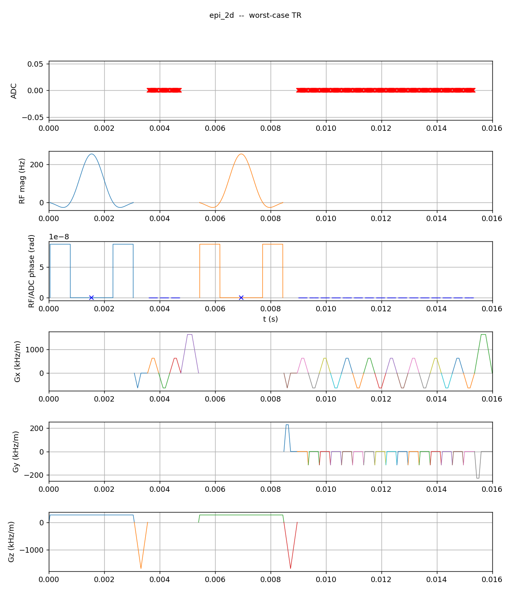
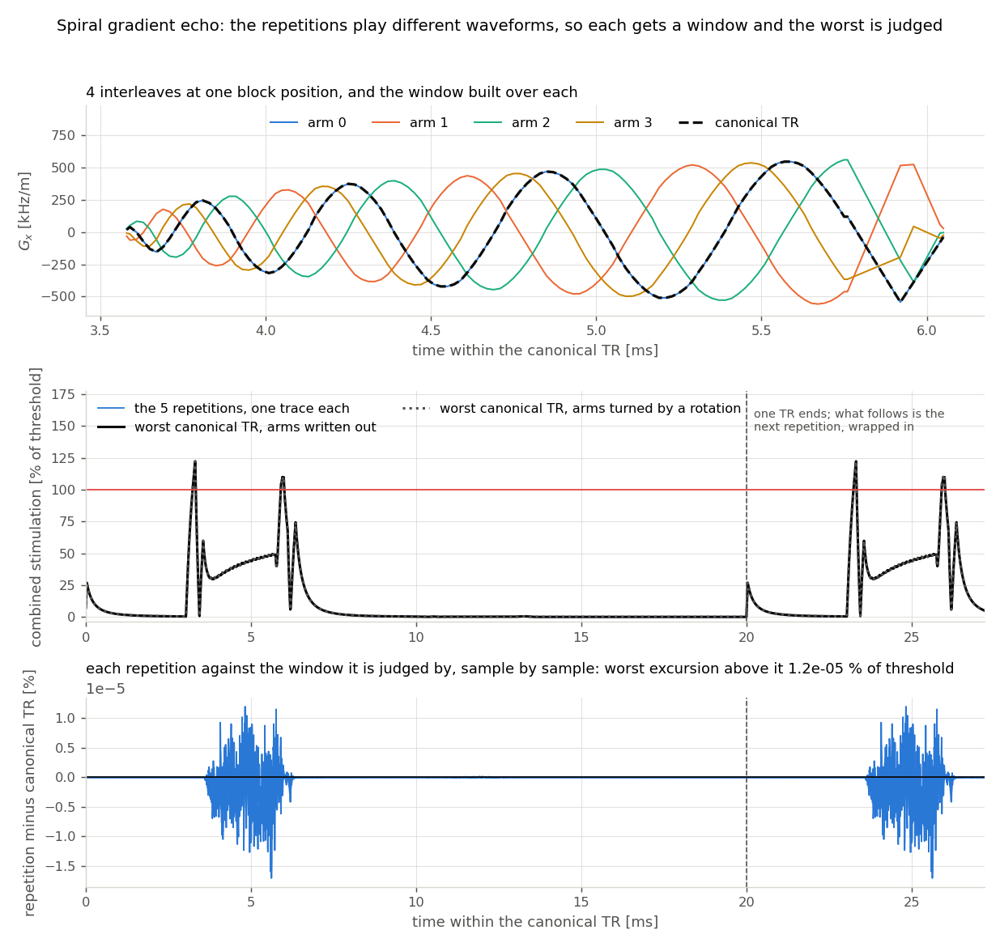
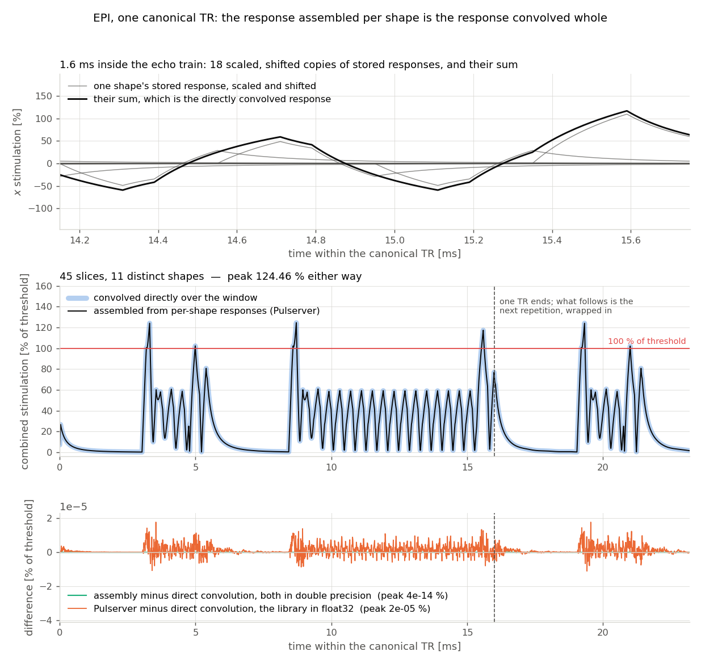

# Peripheral nerve stimulation

{doc}`The estimate itself <../safety/pns>` is a convolution: the slew rate of
every gradient axis against a nerve response, and the peak of what comes out
against the threshold. Written directly, that is a pass over every sample of
the sequence — and a protocol is minutes of samples at gradient raster.

Three things make it a check a scanner can run at predownload. It runs over
**one window** rather than the scan; that window is built to stand for **every
repetition** of it; and inside it the response is **assembled from per-shape
pieces** rather than convolved. None of the three is allowed to change the
answer, and the two figures below are where that is shown rather than claimed.

Everything here is the **Irnich rheobase/chronaxie** model, on both sides of
every comparison: it is the one the scanner-side gate runs, and it is the one
the third shortcut applies to at all.

An EPI shot is the hard case, and the one measured throughout here: its blip
train switches a readout gradient dozens of times a few hundred microseconds
apart, so the nerve response never returns to baseline between events.

## One window, not the scan

The scan is the {doc}`structural TR <../sequence_model/tr_and_segmentation>`
repeated, so the peak inside one window — evaluated periodically, with the
history wrapped round from the window's end so the model starts warm rather
than from rest — is the peak of the steady-state scan.

The same EPI protocol at four scan lengths, with the repetition held fixed,
convolved with the chronaxie kernel throughout:

| Blocks | TRs | Over the timeline | Over the canonical TR | Pulserver (assembled) |
|---:|---:|---:|---:|---:|
| 297 | 3 | 8 ms | 3 ms | 2.0 ms |
| 1 188 | 12 | 40 ms | 3 ms | 2.1 ms |
| 4 752 | 48 | 148 ms | 3 ms | 2.1 ms |
| 14 256 | 144 | 454 ms | 3 ms | 2.2 ms |

The first two columns are the same convolution — the direct one written out
below, in double precision — run over the whole scan and over one window, so
their ratio is the algorithm rather than two codebases. The third is what
Pulserver returns for that same window — faster still, for the reason the
assembly section below gives.

Forty-eight times the scan is fifty-seven times the timeline evaluation and no
change at all to the window one. Fourteen thousand blocks is a small protocol:
the timeline column grows with the scan for as long as the scan grows, and a
clinical prescription is two orders of magnitude longer than this one.

The peaks agree the way they must. The timeline reports 1.632 at every scan
length — it is the same repetition, played more times — and the canonical TR
reports 1.660, above it, because the window is the worst-case envelope
evaluated periodically rather than the scan played once from rest. The last two
columns report the same peak to seven digits — 1.660 608 1 convolved whole
against 1.660 608 3 assembled — because they are the same window under the same
model, evaluated two ways.

## One window for every repetition

The repetitions of a scan are not copies of each other: a phase encode steps, a
partition moves, a spiral arm turns. So the window is not any one repetition —
it is built to stand for a whole set of them, position by position, taking at
every block the largest amplitude that position reaches. A waveform nobody
plays, judged in place of all the ones who do.

What one such window can stand for is decided by **shape**. Repetitions that
play the same gradient waveforms and differ only in how hard a position is
driven are covered by taking the largest of those amplitudes: the same shape
driven harder is a larger response at every instant on every axis, and the
verdict is a root-sum-square, which only grows with them. That is the whole of
a Cartesian scan, and one window is the end of it.

Repetitions that play *different* waveforms at a position are not covered that
way, because there is no amplitude at which one spiral arm's shape covers
another's. So they are not asked to be: the repetitions are grouped by the
definitions they play, a window is built over each group, and the worst of them
is the verdict. A sequence whose repetitions differ only in amplitude has one
group and one window; a four-arm spiral written out as its own waveforms has
four.

The top panel is the situation: four arms at one block position, and — drawn
over arm 0, which is the group it belongs to — the window that group is judged
by. The middle panel is the verdict: every repetition's stimulation, and the
worst window's, which agree here to 1 × 10⁻⁵ % of threshold. The bottom panel
is that agreement without the overplotting. The peak is 122.206 %, and it is
the same 122.206 % whether the four arms reach the scanner as four written-out
waveforms or as one arm plus a `ROTATIONS` extension.

That the four arms stimulate identically is not a coincidence, and the reason
is worth having. The chronaxie response applies one kernel to every gradient
axis, so it commutes with the rotation that turns one arm into the next; and
the verdict is a root-sum-square over axes, which a rotation leaves alone.
Turning a spiral moves stimulation between $G_x$ and $G_y$ — it does not change
how much of it there is. A model with per-axis coefficients has no such
symmetry to lean on, and a rotation extension is applied below this analysis
rather than inside it, so for one of those the rotated arm is not what is seen.

The cost of a group is one window, and the number of groups is the number of
distinct sets of waveforms the repetitions play — one per arm, never one per
repetition. Sweeping them is cheap for the reason the next section is about:
the per-shape responses are already stored, so a second group is mostly a
matter of placing them again.

## Assembled from per-shape pieces, not re-convolved

Inside the window, the plain evaluation materialises the slew over the whole
canonical TR and convolves it with the nerve kernel. That is $3NK$ multiply-adds
for $N$ samples against a kernel of $K$, and $K$ does not shrink with the
sequence: the Irnich kernel is twenty chronaxie constants of history, 721
samples at the raster these figures are drawn on.

A nerve model that publishes a kernel is asserting that it is a linear filter:

$$r(t) = \bigl(k * \dot G\bigr)(t).$$

A filter does not care when its input arrives. In the frequency domain it is a
multiplication, which distributes over a sum, and a delay is a phase factor
that comes back out unchanged — which in the time domain is the statement that
convolution is linear and shift-invariant. The window is already written as a
sum of delayed shapes, because that is what a block list is:

$$G(t) = \sum_i a_i\, g_{c(i)}(t - t_i),$$

block $i$ playing shape $g_{c(i)}$ at amplitude $a_i$ from time $t_i$.
Differentiation and convolution both distribute over that sum, so

$$r(t) = \sum_i a_i \,\bigl(k * \dot g_{c(i)}\bigr)(t - t_i).$$

Each *distinct* shape is convolved once and stored; every occurrence of it
becomes a scaled, shifted add of the stored result. Nothing has been truncated,
resampled or approximated on the way — the two expressions are the same sum,
regrouped — so the difference between them is floating-point rounding and
nothing else.

Two details make that true of the implementation and not only of the algebra.
**At the seams**, each block's slice contributes its slew zero-extended on both
sides: it opens with the step up from zero into the block and closes with the
step back down out of it, so where two blocks meet, the closing step of one and
the opening step of the next add to exactly the difference a forward difference
across the seam would have subtracted — the same two floats, the same
subtraction. **Around the window**, the leading occurrences are placed a second
time one window later, which is the same warmed-up history that wrapping the
waveform round gives the direct route.

The top panel is the mechanism, on one axis, over 1.6 ms of the echo train:
eighteen scaled and shifted copies of stored responses, and their sum. It is one
axis rather than the combined trace because the decomposition is per axis — the
verdict is a root-sum-square, and a root-sum-square does not decompose. The
middle panel is the whole window: what Pulserver returns, drawn over a direct
convolution of the same waveform, written from the published kernel in double
precision. The bottom panel is the difference between them, and it separates
two things. Regrouping the sum in double precision moves the answer by
4 × 10⁻¹⁴ % of threshold, which is the algebra being exact; Pulserver sits
2 × 10⁻⁵ % away, which is the float32 it computes in.

The trade is that cost stops scaling with the length of the window and starts
scaling with the number of distinct shapes in it:

| Canonical TR | Length | Slices | Distinct shapes | Direct | Assembled |
|---|---:|---:|---:|---:|---:|
| EPI, 2D | 16 ms | 45 | 11 | 5.0 M | 0.66 M |
| Spiral GRE, 2D | 20 ms | 7 | 7 | 5.9 M | 0.72 M |
| FSE, 2D | 300 ms | 27 | 8 | 66 M | 1.0 M |
| MPRAGE, stack of spirals | 500 ms | 22 | 15 | 110 M | 1.9 M |
| MPRAGE, Cartesian | 600 ms | 61 | 9 | 131 M | 0.57 M |

Multiply-adds, counting each stored shape convolved once and each occurrence
placed twice. A 16 ms echo train buys a factor of eight; a 600 ms inversion
train buys a factor of 230, because its length grew and its shape count did not.

Two guards keep the gate honest. The stored shapes are slices of *the very
waveform the direct route would convolve*, so there is no second renderer to
drift away from the first; and every occurrence is checked against that waveform
to really be a scaled copy of its shape before it is accepted, which costs a
pass over the samples rather than a convolution of them. One failed check and
the direct route runs instead.

The fast route exists only where there is a kernel to publish. A model that is
not a convolution cannot publish one — SAFE's three branches rectify on both
sides of their lowpass — and takes the direct route always.

## What is still allowed to scale

Nothing here is free of the sequence — only of the scan. Three things move the
window's own cost:

- **The repetition's duration.** More samples of response to accumulate, and
  more waveform to materialise before any of it starts. On a long TR the
  materialisation, not the nerve model, is most of what is left.
- **The number of distinct shapes in it.** This is what the assembly trades
  against: a window built from a dozen shapes is cheap however many times it
  plays them, and one built from thousands is not. It is the same quantity the
  {doc}`sequence_creation` page reports as the `ROTATIONS` win.
- **The kernel's length.** Twenty chronaxie constants of history, on the raster
  the slew is built on, is what the model asks to be padded with and what every
  stored shape is convolved against.
