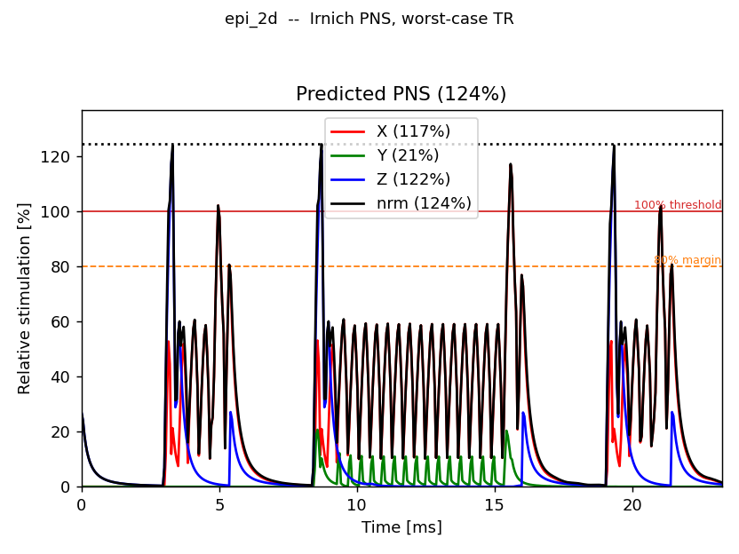

# Peripheral nerve stimulation

{doc}`The estimate itself <../safety/pns>` is a convolution: the slew rate of
every gradient axis against a nerve response, and the peak of what comes out
against the threshold. Written directly, that is a pass over every sample of
the sequence — and a protocol is minutes of samples at gradient raster.

Two things make it a check a scanner can run at predownload. It runs over
**one window** rather than the scan, and inside that window it is assembled
from **per-shape responses** rather than re-convolved.

An EPI shot is the hard case, and the one measured throughout here: its blip
train switches a readout gradient dozens of times a few hundred microseconds
apart, so the nerve response never returns to baseline between events.

## One window, not the scan

The scan is the {doc}`structural TR <../sequence_model/tr_and_segmentation>`
repeated, so the peak inside one window — evaluated periodically, with the
history wrapped round from the window's end so the model starts warm rather
than from rest — is the peak of the steady-state scan.

The same EPI protocol at four scan lengths, with the repetition held fixed,
under the same SAFE model on both sides:

| Blocks | TRs | Over the timeline | Over the canonical TR |
|---:|---:|---:|---:|
| 297 | 3 | 79 ms | 3.4 ms |
| 1 188 | 12 | 366 ms | 3.6 ms |
| 4 752 | 48 | 1 185 ms | 3.1 ms |
| 14 256 | 144 | 3 566 ms | 3.5 ms |

Forty-eight times the scan is forty-five times the timeline evaluation and no
change at all to the window one. Fourteen thousand blocks is a small protocol;
the timeline column is already seconds, and it grows with the scan for as long
as the scan grows.

The peaks agree the way they must: the timeline reports 1.273 at every scan
length — it is the same repetition, played more times — and the worst-case
envelope reports 1.331, above it, which is what an envelope is for.

The timeline route is not a straw man. It is `tr=None`, and `tr=None` is
upstream PyPulseq exactly — the same function, on the same blocks, to the bit.
That is what makes it the right thing to compare against, and it is pinned by
`test_pns_over_the_timeline_is_upstreams_answer_exactly`.

## Assembled from per-shape responses, not re-convolved

Inside the window, the plain evaluation materialises the slew over the whole
canonical TR and convolves it with the nerve kernel. But the window is built
from a handful of gradient shapes repeated at different amplitudes, and for a
*linear* nerve model — Irnich publishes its kernel — convolution distributes
over that sum: each distinct shape is convolved **once**, and every occurrence
becomes a scaled, time-shifted add of that stored response. Cost stops scaling
with the TR length and starts scaling with the number of distinct shapes.

The boundaries are where such a scheme would naïvely go wrong, and where this
one is exact by construction. Each block's slice of the window contributes its
slew *zero-extended on both sides* — opening with the step up from zero and
closing with the step back down — so at the seam between two blocks the
closing step of one and the opening step of the next add to exactly the
difference the directly rendered waveform would have. The blip riding on the
readout ramp, the plateau handed from one block to the next: all of it sums
back, in floating point, to the rendered window's own numbers.

Two guards keep the gate honest:

- the templates are slices of *the very waveform the exact path would
  convolve*, so there is no second renderer to drift from the first;
- every occurrence is checked to really be a scaled copy of its template
  before it is accepted — one failed check and the exact route runs instead.

A model that does not publish a kernel takes the exact route always: SAFE is
nonlinear, so the column above is the exact convolution throughout. The Irnich
model the scanner-side gate applies is the one that assembles, and it runs in
about 2 ms on the same window.

## What is still allowed to scale

Nothing here is free of the sequence — only of the scan. Two things move the
window's own cost:

- **The repetition's duration.** A longer TR is more samples of response to
  accumulate, and the cost follows it about linearly.
- **The number of distinct shapes in it.** This is what the assembly trades
  against: a window built from a dozen shapes is cheap however many times it
  plays them, and one built from thousands is not. It is the same quantity the
  {doc}`sequence_creation` page reports as the `ROTATIONS` win.

## The equivalence tests

| Claim | Test |
|---|---|
| `tr=None` is upstream PyPulseq to the bit | `test_pns_over_the_timeline_is_upstreams_answer_exactly` |
| the assembled response equals the convolved one | `run_pns_memo_equivalence` (C suite, `tests/ctests/test_safety_grad.c`) |
| the compiled SAFE model is upstream's Python one | `test_the_c_safe_model_matches_upstreams_python_one` |
| the worst-case envelope bounds every real repetition | `test_the_worst_case_tr_bounds_every_instance_it_stands_for` |

`run_pns_memo_equivalence` runs per sequence family and holds the two routes
to a few floating-point rounding steps — the only difference between them
being the order of two multiplications.
