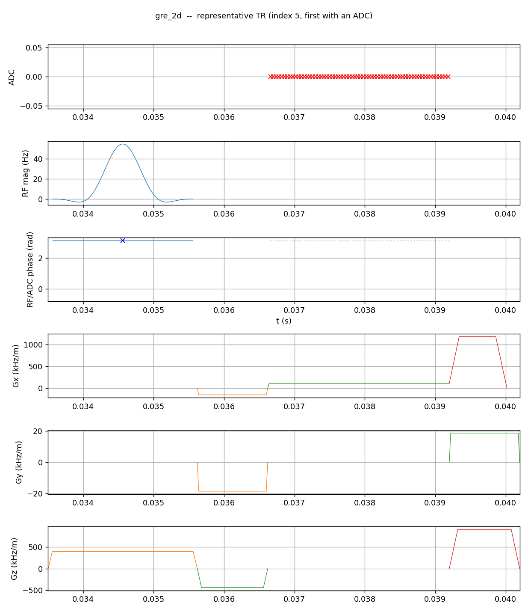
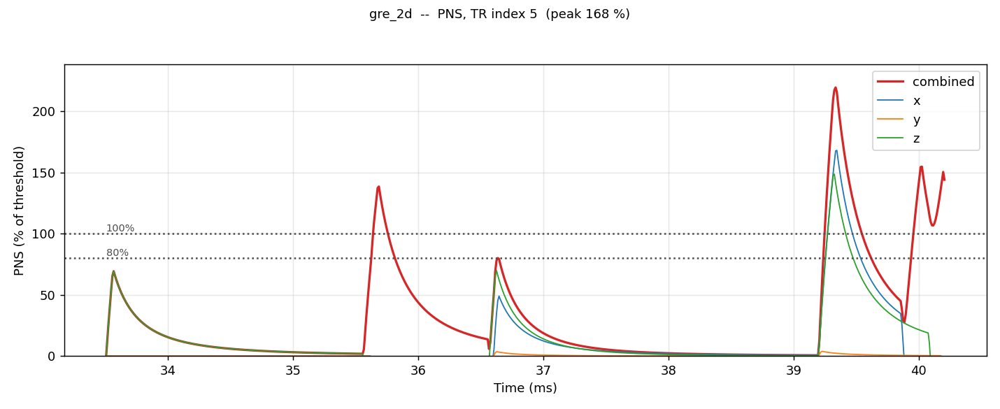
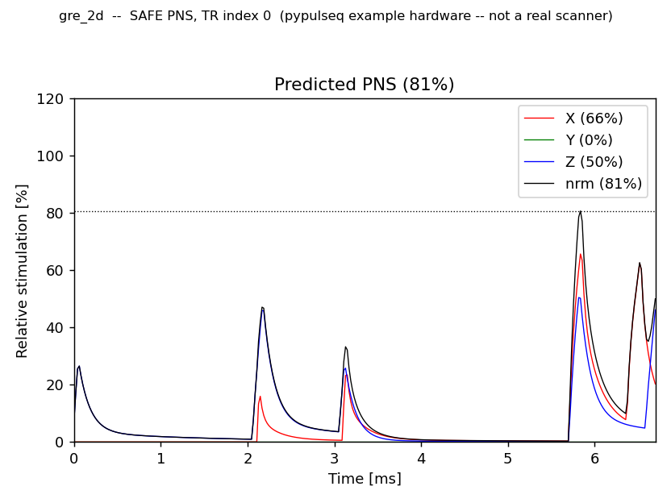

# Peripheral nerve stimulation

A changing magnetic field induces an electric field in tissue. Switch a
gradient fast enough and the induced field depolarises peripheral nerve
membranes, which the subject feels — a tap, a twitch, at worst pain. Unlike
{doc}`mechanical resonance <mechanical_resonance>`, this is a limit on the
subject, not the hardware, and it is regulatory rather than advisory.

The quantity that stimulates is not the gradient amplitude but its **rate of
change**, $\mathrm{d}G/\mathrm{d}t$ — and not its instantaneous value either.
A nerve integrates: a short, intense slew and a longer, gentler one can be
equally stimulating. The threshold therefore depends on pulse *duration*, and
the classical description of that dependence is the strength–duration curve.

## Two nerve models, both first class

Two model families describe that curve in practice, and Pulserver supports
both on equal footing — which one runs is decided by the hardware description
you pass, because the model and its coefficients belong to the *gradient
coil*, not to the sequence.

**Irnich rheobase/chronaxie**, the form GE systems use. The stimulation
threshold for a rectangular slew pulse of duration $\tau$ rises as the pulse
shortens:

$$S_\text{thr}(\tau) = \frac{S_\text{min}}{1 - \bigl(\tfrac{c}{c+\tau}\bigr)}
\quad\text{with}\quad S_\text{min} = \frac{\text{rheobase}}{\alpha},$$

where $c$ is the **chronaxie** time, the **rheobase** is the asymptotic
threshold for an infinitely long pulse, and $\alpha$ is a coil attenuation
factor. Realised as a filter, this is a convolution of the slew waveform with
the kernel

$$k[i] = \frac{\Delta t}{S_\text{min}}\cdot\frac{c}{(c + i\,\Delta t)^2},$$

whose tail decays as $1/\tau^2$ and is truncated after 20 chronaxie
constants. The result is a fraction of threshold, per axis, at every instant.

**SAFE** (Hebrank and Gebhardt), the form Siemens `.asc` hardware files
describe. It is not a single convolution: each axis passes through a small
cascade of nerve-response stages with coil-specific coefficients, and the
combination is nonlinear. Pulserver's compiled engine implements it alongside
Irnich, and its answer is held equal — sequence by sequence, in the test
suite — to the open Szczepankiewicz–Witzel implementation that upstream
PyPulseq ships.

Both are available from
{meth}`pulserver.pypulseq.Sequence.calculate_pns`, selected by the shape of
the `hardware` argument: a mapping carrying `chronaxie` and `rheobase`
selects Irnich, a Siemens `.asc` path or a per-axis description selects SAFE.

```python
irnich = {"chronaxie_us": 360.0, "rheobase": 4.25e8, "alpha": 0.333}
ok, norm, components, t = seq.calculate_pns(irnich, tr="worst_case")         # Irnich
ok, norm, components, t = seq.calculate_pns("scanner.asc", tr="worst_case")  # SAFE
```

The hardware description is always passed in, never read off the system
limits: a sequence author's `Opts` describe the gradients they are designing
for, not the coil's nerve-response coefficients, and conflating the two would
let a plot silently use the wrong model. Because the coefficients are the
coil's, no sequence file carries them — which is why the check is opt-in:
supply the model and it runs, omit it and Pulserver does not guess.

## The check

The evaluation itself is the direct one. Build the gradient waveform on the
gradient raster, differentiate it to get the slew, run the nerve model on
each axis, combine the axes, and compare the peak of the combined response
against threshold. There is no shortcut around evaluating the whole window:
the verdict is the *peak of a running response with memory*, and two adjacent
events each at 60 % of threshold may combine to 90 % or to 30 % depending
entirely on their relative timing and sign. The instant of the peak is a
property of the whole window, so the whole window is evaluated.

The window is the {doc}`structural TR
<../sequence_model/tr_and_segmentation>` — the repeating unit the scan is
made of — taken at its worst case: where an amplitude varies across
repetitions, the check sees the largest one, so the answer bounds every
repetition of the real scan. Because a TR plays back to back with copies of
itself, the response at the start of one TR depends on the end of the
previous one; the evaluation accounts for that history, so the peak found
inside one TR is the peak of the steady-state scan, boundaries included.
How this — and the caching that makes the evaluation interactive — is
implemented, and the tests that hold the fast path exactly equal to the
plain one, are on the {doc}`performance page <../performance/index>`.

```{note}
This estimate is not the regulatory verdict. The scanner's own predownload
check is, and the hardware monitor stands behind that. What the design-time
estimate buys is that a sequence which will be refused is refused *while it
is being written* — computed by the same compiled code the interpreter links,
so the two answers cannot disagree by reimplementation.
```

## What the two models look like

The corpus figures below pair each sequence's worst-case TR with its Irnich
stimulation trace; the SAFE figure uses upstream PyPulseq's own example
coefficients (explicitly *not* a real scanner's) on the same GRE fixture.

**GRE**, one isolated readout gradient per TR — three isolated spikes, one
per gradient event, decaying between them because nothing else is playing:







**EPI**, a long blipped echo train, is the sharpest contrast available — a
readout gradient reversed dozens of times a few hundred microseconds apart is
a qualitatively different stimulation problem from GRE's well-separated
events:


Every blip adds its own rising edge before the previous one has decayed, so
the per-blip peaks ride on a sustained, near-saturated plateau across the
whole train instead of returning to baseline. The nerve's memory genuinely
matters here — which is exactly why the check evaluates a full TR with its
history rather than scoring events one at a time.
