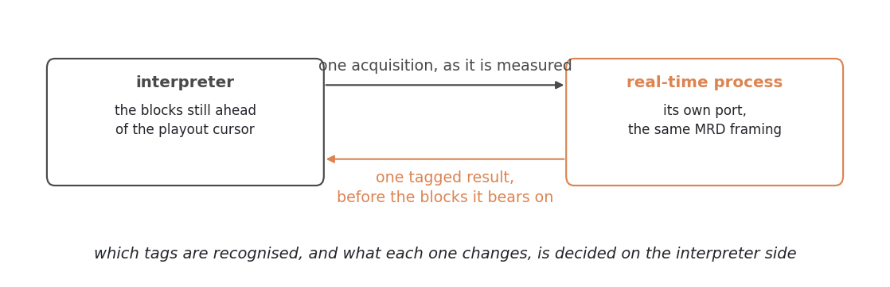

# The MRD path: client and server

{doc}`MRD <../background/ismrmrd>` defines what a reconstruction service
receives. On a real scanner, both ends of that definition are missing: the
vendor acquisition system emits its own native raw-data packets rather than
MRD, and the vendor reconstruction pipeline is not a place a Python
reconstruction can run. Pulserver supplies both — a C++ **client** that turns
the scan into a vendor-neutral stream, and a Python **server** that
reconstructs it — connected by nothing but the
{doc}`MRD session protocol <../background/ismrmrd>`.

That is what makes each half replaceable. The client speaks to any MRD
server: Gadgetron, the Python MRD services, or Pulserver's own. The server
accepts any MRD client, and reconstructs a file recorded from one just as it
reconstructs a live scan.


## The client: producing the stream

The client runs beside the vendor's own reconstruction pipeline and does
three jobs, in order.

### Convert on the fly

As acquisitions arrive from the spectrometer, the client converts each native
packet to an MRD acquisition and sends it immediately — streaming while the
scan runs, not exporting after it ends, which is what makes real-time and
long-scan reconstructions possible at all.

The vendor-specific half of this is deliberately confined to one component.
On GE the client is built on the Orchestra SDK and uses GE's own
`ge_to_ismrmrd` converter for the packet translation; the converter sits
behind an interface, so a different vendor's converter — or a different
GE-side one — slots in without touching the enrichment or the session logic
below.

### Enrich from the Pulseq file

A converted packet is samples with a vendor header — correct, but ignorant:
it does not know its k-space trajectory, where its echo sits, or which
encoding space it belongs to. Everything it is missing is knowledge the
*sequence* has, so the client reads the sequence: the same `.seq` chain the
scanner played, parsed in C++ (`read_sequence_files()` walks the
`NextSequence` chain, text or binary). From it, the client fills in:

- **The MRD header**: the encoding spaces with their matrices, fields of
  view and encoding limits, derived per subsequence — a calibration prescan
  and its imaging scan each get their own encoding space.
- **Per-acquisition counters and flags**: the design side writes its loop
  counters into the file as labels, so each acquisition is stamped with the
  `idx` counters and role flags MRD expects, plus its echo position
  (`center_sample`) and dwell time. The first/last boundary flags are derived
  here, from the counters and arrival order.
- **The k-space trajectory**, computed from the gradient waveforms and
  attached per readout wherever k does not advance at a constant rate across
  the ADC window — the test is per axis, so a Cartesian readout that samples
  its ramps gets a one-dimensional trajectory along the readout while its
  flat axes stay in the counters, and a readout played entirely on a plateau
  gets none because there is nothing a counter cannot say. The reconstruction
  never re-derives it from vendor parameters.
- **The sequence description**, streamed in band as MRD waveforms: the RF
  definitions with their shapes and shim vectors, the event timeline of one
  TR, and the echo layout — enough for parameter fitting or subspace
  reconstruction to know what the data are. It rides the standard waveform
  message, so a server that does not need it simply ignores it, and
  physiological traces travel the same channel beside it.

### Undo the FOV shift

An off-isocentre prescription is applied at design time as a phase — the
sequence is played as if at isocentre, and every sample carries
$e^{-i\,2\pi\,\Delta r \cdot k}$ for the prescribed offset $\Delta r$. The
client undoes it: after the trajectory is attached, each acquisition is
demodulated by the matching phase, $\Delta r \cdot k$ evaluated per sample.

Both the shift and the trajectory live in the *logical* frame — readout,
phase, slice — and the product $\Delta r \cdot k$ does not change when both
are rotated together, so neither the client nor the reconstruction ever needs
to know the prescribed orientation, a per-block rotation, or a motion
correction's updates. The sign convention matches the design side exactly:
a sequence shifted at design time and one shifted here reconstruct
identically.

What leaves the client is a stream with no vendor semantics left in it — the
constraint the {doc}`session protocol <../background/ismrmrd>` imposes, met
by construction. See {doc}`../../examples/cpp/gadgetron_client` for the
client in use.

## The server: consuming the stream

Pulserver's own server is an MRD server like any other: it listens on a TCP
port, accepts a connection, reads the configuration message and the header,
and reconstructs what follows. The configuration message names the
reconstruction — a module name, or the absolute path of the recon script
staged with the sequence, which is what the scanner sends, so a scan and its
reconstruction are downloaded together and no server-side registration step
exists. A stream naming nothing recognisable falls back to a handler that
records the data and returns.

Each connection reconstructs through its own copy of the plugin
(`plugin.spawn()`), so the configured `PLUGIN` a module exposes stays a
template: an expensive thing it holds — a loaded network, a
compiled operator — is shared across concurrent scans, while everything the
lifecycle hooks assign stays private to one stream. Acquisitions are handed
to the plugin as they arrive; waveforms are collected and given to every
reconstruction of the scan, because they describe the measurement rather than
the image. What the plugin returns is sent back up the same socket as MRD
images, or converted to DICOM first if it asked for that.

Three things beyond that are the server's own, and each exists because a
scanner is not a workstation.

### The exam, not the connection, is the unit of context

Sensitivity maps, a subspace basis, a gridding plan: these are expensive,
and within one exam they are often the *same* for scan after scan. So each
reconstruction receives a context carrying not only the header and the
configuration but an **exam cache** — a keyed store whose `get_or_create`
runs its factory at most once per key, with an optional cleanup for values
holding GPU memory.

The exam identity comes from the header: an `ExamID` user parameter if the
exporter writes one, otherwise the standard study identity. The measurement
identity is deliberately *not* used, because it changes between the sequences
of a single exam, which is exactly the boundary the cache is meant to cross.
A header with no exam identity at all gets a private generation, so nothing
is ever shared by accident.

Observing a header with a different exam identity retires the current
generation immediately — the next patient never inherits the previous
patient's calibration. Retiring is not freeing: a reconstruction that already
leased the outgoing generation keeps it alive and valid until it finishes, and the
artifacts are released on the last lease returned. A new exam therefore starts a fresh generation rather than emptying the old
one, because a scanner can begin the next exam while the previous scan is
still reconstructing.

Keys should carry what an artifact actually depends on — geometry, coil
configuration, trajectory or basis identity. Sharing an exam does not by
itself make two sensitivity maps interchangeable.

### Concurrency is derived from RAM, not guessed

An iterative or deep-learning reconstruction is measured in tens of
gigabytes, and two of them on a box that fits one do not run half as fast —
they swap, or the kernel kills one. The server therefore admits a bounded
number of simultaneous reconstructions, and derives the bound from the
machine:

$$
\text{slots} = \max\left(1,\ \left\lfloor \frac{\text{available RAM} \times 0.8}{\text{RAM per reconstruction}} \right\rfloor\right)
$$

with 48 GiB per reconstruction as the default estimate, sized for an
iterative or deep-learning reconstruction on a current scanner's
reconstruction engine. On a 156 GiB machine with ~142 GiB available, that is
two slots and a 96 GiB working set.
Both the per-reconstruction estimate and the resulting limit are overridable,
by command-line flag or environment variable, for a machine or a
reconstruction that is not typical.

### A scan that arrives with no slot free is queued, not dropped

Refusing the connection is not an option — the scan has already happened, and
the client has nowhere to put the data. Stalling the client is not one
either: the acquisition system needs its buffers back.

So when every slot is busy, the server still consumes the stream in full,
writing it to an MRD file as it goes, and drops a small JSON file beside it
naming the reconstruction that was requested. The client sees an ordinary,
complete session. A background worker then picks up the oldest of those,
waits for a slot, and runs the requested reconstruction against the file. Its
name changes as it goes — queued, processing, then processed or failed —
which is both the record of what happened and what stops two workers taking
the same session; one still marked `processing` at startup belonged to a
process that died, and is retried.

The replayed scan runs through the same plugin lifecycle, the same exam
lease and the same output handling as a live one; only the source of the
acquisitions and the destination of the images differ, and both sit behind
the same small connection interface. There is no second reconstruction path
to keep in step with the first — which is also why reconstructing a recorded
file needs no server at all:

```python
from pulserver.app import cartesian2D_recon

images = cartesian2D_recon("scan.h5")
```

opens the file, hands the header to the plugin as its context, and drives the
ordinary hooks over the acquisitions in acquisition order — in process, with
no socket and no port.

## Closing the loop in real time

Reconstruction consumes a scan. A real-time process *changes* it: something
measured mid-scan comes back in time to alter what is still to be played.
That needs a different contract — not throughput but a bounded round trip —
so it gets its own port, with the same MRD framing on it and a strictly
synchronous exchange: one acquisition out as it is measured, exactly one
result back for it, before the interpreter reaches the blocks the result
bears on.



The channel is deliberately uncommitted about what a result *means*. It
carries a tagged payload, and the tag is what the interpreter dispatches on:
which tags it recognises, and what each one does to the blocks still ahead of
the cursor — a geometry update, a rejected TR replayed, a parameter moved —
is decided on the interpreter side and nowhere else. Feedback of a new kind
is a new tag and the interpreter's handling of it; the transport, which only
has to be fast and deterministic, does not change.
