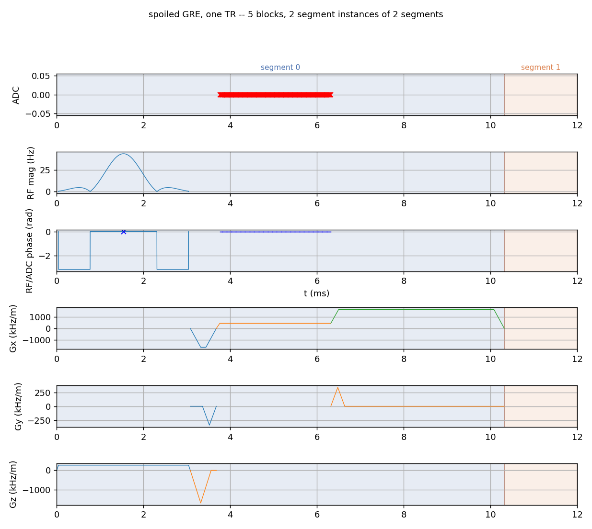
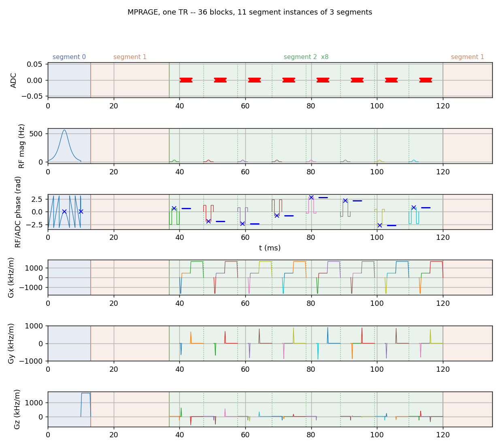
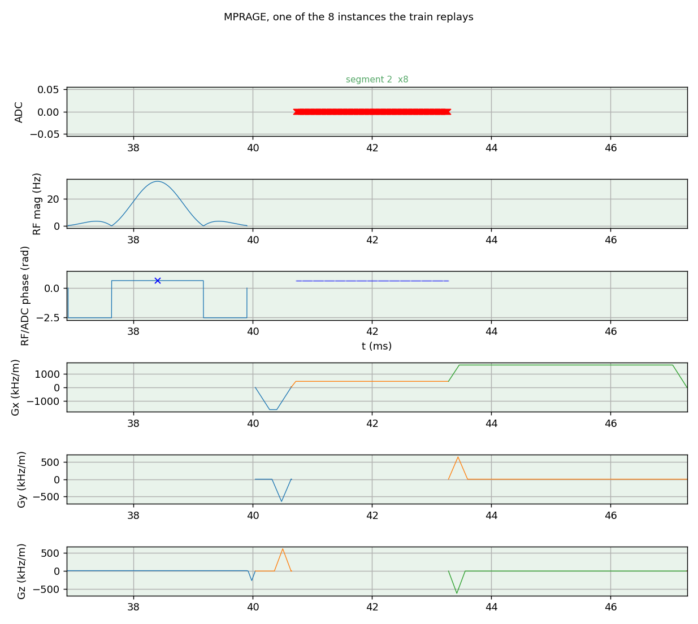

# The structural TR, and segments

A Pulseq file is a flat list of blocks. Playing it is not: a scanner
executes *segments* — short reusable units it prepares once and replays with
per-instance amplitudes — and it gates the scan on quantities defined over a
*repetition*: SAR over the worst TR, gradient heating over the duty cycle,
acoustic response over the periodic drive. Neither the segment nor the
repetition is written in the file.

Pulserver derives both from the block content, and derives them the same way
on every file. This page explains what is derived, what it is used for, and
why the alternative — annotating the file — was rejected.

## The repeating unit is a property of the content

Take the first block, and ask whether the stream is periodic with period
$P$: whether block $n$ and block $n + P$ have the same normalized structure —
the same duration, playing on the same channels — for every $n$. The smallest
$P$ that holds over the whole table is the **structural TR**, and `tr_size`
blocks is its length.

Two properties make this well-posed:

- **Everything a playout can vary is excluded.** A phase encode steps from
  line to line; a spoiler's phase advances every shot; an RF pulse alternates
  sign; a radial view rotates; a navigator acquires on some repetitions and
  not on others. Those are per-instance parameters of one structure, not
  different structures, and the comparison ignores all of them: amplitudes,
  which waveform variant a gradient plays on this shot, the frequency and
  phase offsets of RF and ADC — in hertz or in ppm — whether the block's ADC
  acquires this time round, the rotation, whether a trigger fires. What is
  compared is the timing each event occupies inside the block: an RF pulse by
  its delay and its magnitude, phase and time shapes — a pulse is never
  swapped for another under the same structure; a trapezoid by its delay,
  rise, flat and fall; an arbitrary gradient by its delay and its time shape,
  or its sample count where the samples sit on the raster; an ADC by its
  delay, dwell and number of samples. A segment is a timing pattern.
- **Pure delays match any pure delay.** A TI fill or a TR pad whose duration
  varies is one position whose duration is a runtime parameter, not a
  different sequence. This is the same relaxation the Pulseq specification
  makes for its reserved implicit-delay blocks.

For a gradient echo the answer is the obvious one: excitation, prewinder,
readout, a combined rewinder and spoiler, pad — five blocks, repeated once per
line. For an FSE it is the whole echo train, because that is the unit that
repeats. For a ZTE it is the whole shell -- the ramp onto the first spoke,
then a pulse and an acquisition per view -- because the shell opens and closes
differently from the way it runs, and it is the shell a shot repeats.
Detection reports what the sequence is, not what its author called it.

```{note}
`Sequence.declare_tr()` writes the detected block count into
`[DEFINITIONS] TRSize` when the file is written, so a consumer that wants the
answer need not re-derive it. It remains a *hint*: the interpreter verifies
the pattern repeats and falls back to full detection, and a reconstruction
that does not find it simply skips the description it would have built.
```

## What the TR is for

Three consumers, all of which would otherwise have to guess:

**Safety.** SAR is defined per unit time over the worst repetition; a scan
whose flip angle varies shot to shot has a worst one that is not the first
one. The RF checks walk the TR instances and take the worst B1rms, not the
average and not the first. The gradient-heating and acoustic checks need a
*period* to compute a spectrum over at all — see
{doc}`../safety/mechanical_resonance`.

**Playout.** A segment is prepared once and replayed; the boundary of the
repeating unit is where the interpreter can safely close a segment and know
the next instance starts in the same state.

**Reconstruction.** The sequence description a reconstruction reads — RF
definitions, echo positions, the ADC roles — is derived over one TR window
and applies to every instance of it. Deriving it over the whole scan would
be the same answer at a million times the cost.

## Segments are the TR, partitioned by structure

Within the TR, Pulserver partitions blocks into **segments**: maximal runs
that repeat identically across instances. A gradient echo yields one segment
(the whole TR) plus the pad; an EPI shot yields the fat saturation, the
train, and the frame-counter block, because those three do not repeat with
the same period as each other.

The partition satisfies the constraints the PulSeg IR specification places on
a virtual segment: every instance has the same block count and the same
normalized structure.

### Two decompositions

A spoiled gradient echo has nothing to reuse inside its own TR. Five blocks:
the four carrying waveforms are one segment, and the pad is the other, split
off because a pure delay is one position whose duration the playout sets. Two
segments, one instance each.



MPRAGE repeats at the shot, not at the line, so its TR is the whole
inversion-recovery experiment — the inversion pulse and its crusher, the TI
fill, a train of spoiled gradient echoes, and the recovery delay that pads out
to the outer TR. Here that is 36 blocks over 135 ms, and three segments cover
them, played eleven times between them.



Segment 1 is played twice, as the 24 ms TI fill and as the 15 ms recovery pad.
Two different durations and one segment, because a pure delay matches any pure
delay: what the interpreter prepares is the position, and how long it waits
there is a runtime parameter.

The eight readouts above are the eight instances of that segment. One of them,
on its own, is four blocks — excite, prewind, read, rewind and spoil:



Every instance occupies that same timing, and almost nothing else about them
matches — look along the train above: the phase encode steps, so each
instance's encoding lobe is a different height; the RF phase advances by the
spoiling increment; the rewinder undoes whatever the encode did. That
difference is exactly what the comparison above excludes, which is why these
are one segment and not eight — and it is the form the scanner wants anyway,
one prepared unit and a table of per-instance amplitudes.

### The declared divergence: content, not annotation

The PulSeg specification makes `TRID` annotation the segment-boundary
convention: the designer labels where segments begin. Pulserver does not read
it for that purpose, and this is a deliberate divergence rather than an
omission.

An annotation is a second source of truth. It can disagree with the content —
a designer edits the blocks and forgets the label — and when it does, the
interpreter is obliged to believe something the sequence does not do. Every
downstream guarantee (the same block count per instance, the same structure,
a segment that can be prepared once) is a property of the *content*, so
deriving the partition from the content makes those guarantees true by
construction instead of by trust.

`TRID` still has a job, a narrower one: when a hyper-TR interleaves several
subsequences, it tells the RF checks which acquisitions belong to which
constituent TR, so SAR and coil heating are computed per constituent rather
than conservatively over the whole. It is never load-bearing — absent it, the
conservative check runs and the hardware monitor still stands.

Concatenated subsequences need no label at all: they are separate `.seq`
files linked by `NextSequence`, loaded as a collection and evaluated
independently.

## Two properties of the answer

**The period is anchored at the first block.** Periodicity is tested from the
start of the stream, so a scan whose opening differs from everything after it
— a catalyst ramp before a bSSFP train — comes back as one long TR. That is
what the file repeats: nothing shorter recurs from the first block onward, and
the catalyst is part of the unit. A single-slice train longer than 15 s
(`SINGLE_TR_MAX_DURATION_US`) is refused outright rather than segmented on a
period that was never verified.

**Granularity is bounded by the hardware, not chosen by taste.** Reading a
scan as one segment played once breaks no rule, and neither does the finest
partition the constraints allow. Pulserver takes the finest one, and it is
the finest one that can actually be played: a boundary is where the sequencer
stops one prepared unit and starts the next, and no gradient can be broken off
mid-ramp without violating the slew limit, so the cuts fall only where the
waveforms already permit playout to pause. The result is the most reuse the
scanner can get out of the file with every unit still physically executable.

## Seeing it

```python
from pulserver.app import gre2D_sequence

seq = gre2D_sequence.main(n_x=256, n_y=64, n_slices=1, te=None, tr=12e-3)

seq.tr_size                   # 5 -- blocks in one repetition
seq.plot(tr="worst_case")     # the repetition the safety checks used

seq.num_segments              # 2 -- the readout run, and the TR pad
seq.plot(segment_idx=0)       # the units the interpreter prepares and replays

seq.sequence_descriptor       # what a reconstruction reads off one TR
```

Nothing here has to be asked for in order: detection and segmentation run in
the C core the first time any of them is wanted, and the result is held until
the blocks change. Writing the file records the block count as
`[DEFINITIONS] TRSize` so the next reader need not derive it again.

Plotting is usually the fastest way to see whether detection found what you
meant. `tr="worst_case"` draws the positional-maximum envelope the gradient
checks run on, and an integer index draws that actual repetition.
`segment_idx` draws one segment as real blocks on the sequence's own clock —
the instance of it carrying the most gradient energy, which is the one the
safety checks were run against — so stepping `0 .. num_segments - 1` shows
the whole decomposition, unit by unit.
