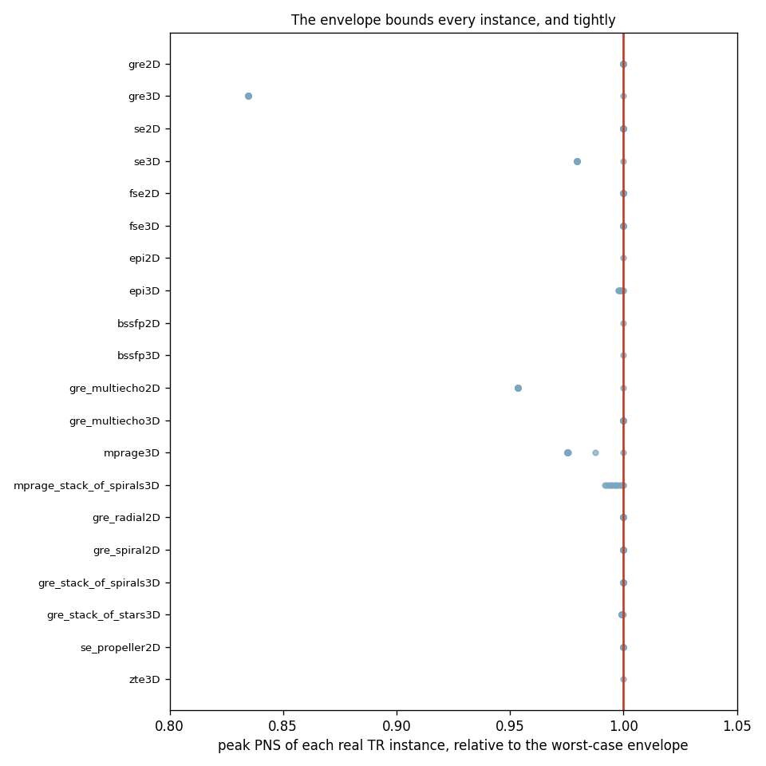
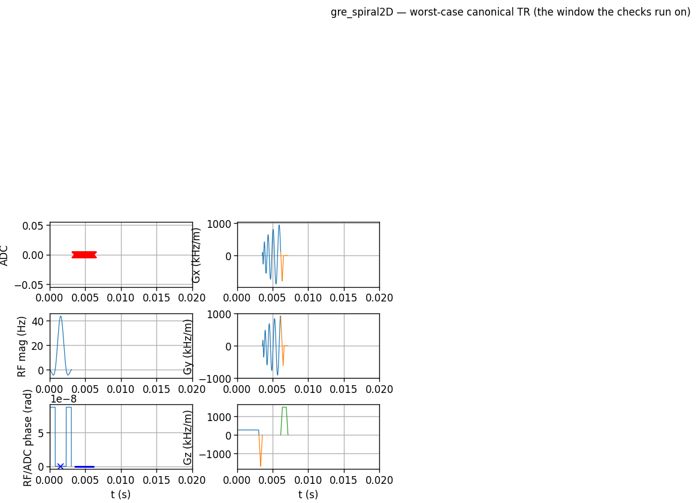
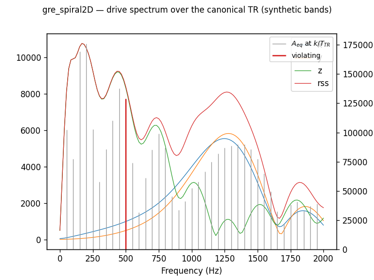
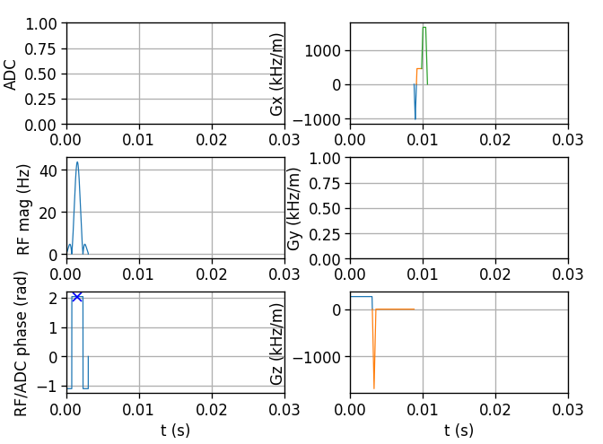
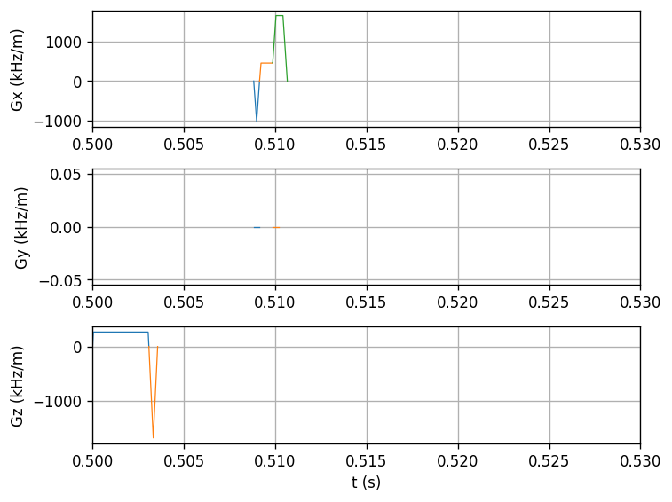

# The sequence zoo

Every claim in the preceding pages is only as good as the sequences it was
tested on. The zoo is that test set: **twenty sequence families** —
Cartesian and non-Cartesian, 2D and 3D, gradient-echo, spin-echo and
steady-state, single-shot and multishot — each an ordinary Python plugin in
`pulserver.app`, each built, written, converted, checked and reconstructed by
the test suite. This page is the zoo run end to end as evidence for three
claims, family by family:

1. **design and conversion stay fast as the problem grows**;
2. **the worst-case canonical TR bounds every repetition the scanner
   actually plays** — including for genuinely multishot sequences;
3. **the analyses over that window are the plain PyPulseq answer** — the
   fast paths change the cost, never the number.

Everything below regenerates with one command:

```bash
python docs/_bench/zoo_report.py     # numbers + figures
python docs/_bench/zoo_table.py      # this page's table
```

## The families, measured

For each family: the largest of three measured sizes, the per-block design
rate at that size, the text serialisation, the C-side parse plus structure
detection, and the detected TR length in blocks. The last two columns are the
safety demonstration, explained in the next sections. The forbidden-band
table used here is **synthetic** (two zero-tolerance bands at 550–650 and
1100–1250 Hz, placed where echo trains and balanced readouts actually put
energy) — the point is that the machinery reaches verdicts in both
directions, not that any of these protocols is unsafe on a real system.

| Family | Blocks | Design | Rate | Serialise | C parse + convert | TR blocks | Envelope bounds instances | In-band lines |
|---|---:|---:|---:|---:|---:|---:|---|---|
| `gre2D` | 26 112 | 0.13 s | 5.1 µs/block | 1.26 s | 13 ms | 6 | yes | none |
| `gre3D` | 51 532 | 0.18 s | 3.5 µs/block | 4.21 s | 32 ms | 4 | yes | 9 flagged |
| `se2D` | 18 432 | 0.17 s | 9.3 µs/block | 0.82 s | 12 ms | 9 | yes | none |
| `se3D` | 25 528 | 0.17 s | 6.5 µs/block | 1.23 s | 15 ms | 8 | yes | none |
| `fse2D` | 9 216 | 0.35 s | 37.4 µs/block | 1.25 s | 9 ms | 36 | yes | none |
| `fse3D` | 19 932 | 0.20 s | 9.8 µs/block | 2.01 s | 14 ms | 132 | yes | none |
| `epi2D` | 2 096 | 0.17 s | 78.8 µs/block | 0.16 s | 4 ms | 67 | yes | 100 flagged |
| `epi3D` | 4 192 | 0.15 s | 36.0 µs/block | 0.36 s | 5 ms | 67 | yes | 100 flagged |
| `bssfp2D` | 6 408 | 0.09 s | 14.0 µs/block | 0.62 s | 5 ms | 417 | yes | 941 flagged |
| `bssfp3D` | 14 454 | 0.20 s | 14.1 µs/block | 1.06 s | 12 ms | 1251 | yes | none |
| `gre_multiecho2D` | 23 936 | 0.13 s | 5.4 µs/block | 1.13 s | 14 ms | 11 | yes | none |
| `gre_multiecho3D` | 48 710 | 0.13 s | 2.7 µs/block | 2.72 s | 24 ms | 10 | yes | 17 flagged |
| `mprage3D` | 78 520 | 0.18 s | 2.4 µs/block | 6.58 s | 42 ms | 260 | yes | none |
| `mprage_stack_of_spirals3D` | 66 820 | 0.32 s | 4.9 µs/block | 34.85 s | 41 ms | 260 | yes | none |
| `gre_radial2D` | 13 408 | 0.13 s | 9.8 µs/block | 3.38 s | 9 ms | 5 | yes | none |
| `gre_spiral2D` | 1 920 | 0.09 s | 44.3 µs/block | 0.55 s | 5 ms | 5 | yes | 39 flagged |
| `gre_stack_of_spirals3D` | 6 272 | 0.08 s | 12.5 µs/block | 2.16 s | 6 ms | 4 | yes | 13 flagged |
| `gre_stack_of_stars3D` | 51 712 | 0.25 s | 4.9 µs/block | 14.11 s | 33 ms | 4 | yes | 11 flagged |
| `se_propeller2D` | 2 560 | 0.30 s | 118.8 µs/block | 1.38 s | 6 ms | 24 | yes | none |
| `zte3D` | 26 002 | 0.98 s | 37.9 µs/block | 31.07 s | 34 ms | 6630 | yes | none |

Three things to read out of the table.

**Throughput scales, and the rate is set by per-shot mathematics, not by the
loop.** Across every family the design rate *falls* as the problem grows —
fixed costs amortise, and the per-block floor is the couple of microseconds
the {doc}`performance page <../performance/index>` measures at
two-million-block scale. The families that sit higher at these demonstration
sizes (spiral, PROPELLER, EPI) are paying for per-shot design work — a
spiral solver, a blade geometry, an echo-train ordering — not for block
appending. At the far end, a full-scale isotropic ZTE of 12.8 million blocks
designs at the same ~50 µs/block as its small version: the rate is a property
of the family, the total a property of the prescription.

**Conversion is milliseconds everywhere.** The C-side parse plus structure
detection — everything the scanner has to do before it can gate the file —
stays between 4 and 42 ms across the zoo, because the cost tracks the shape
library and the TR length, not the block count.

**The TR column is the structure the checks run on**, from six blocks (a GRE
line) through an echo train (36, 67, 132) to a scan honestly read as one
long repetition — bSSFP's catalysed train, ZTE's constantly stepping orbit —
detected from content, never annotated, and validated against an independent
implementation of the PulSeg segment rules by the conformance oracle in
`tests/python/test_pulseg_oracle.py`.

## The canonical TR bounds every repetition

For every family, the worst-case envelope — the window all gradient-side
checks run on — was evaluated with the Irnich PNS model, and so was each of
the first twelve *real* repetitions, exactly as the scanner plays them:



Two properties matter, and the chart shows both. **No instance exceeds the
envelope** — the bound holds across all eighteen families, multishot
included. And **the bound is tight**: most instances peak *at* the envelope,
because the event that dominates stimulation (a slice-select or readout lobe)
is common to every shot; where the per-shot encoding contributes (the 3D
families, MPRAGE's ramped train), instances fall below it — the envelope is a
worst case, not a padded guess.

The multishot families are the reason this needed demonstrating, and they
come in two kinds. **Rotated trajectories** — spiral arms, radial spokes,
PROPELLER blades, ZTE orbits — have instance peaks *identical* to the
envelope, and that is physics, not coincidence: a rotation redistributes the
slew vector among the axes without changing its magnitude, and both the PNS
norm and the mechanical-resonance criterion are evaluated on all axes, so no
rotation can move a shot past a check. **Amplitude-varied trajectories** —
phase-encode tables, ramped flip angles — are bounded because the envelope
takes the largest signed amplitude at every block position. One window is
safe for the scan in either case.

The same window feeds the resonance check. A multishot spiral's readout
oscillation lands as sharp lines, and against the synthetic zero-tolerance
bands it is flagged — as are EPI's echo-train comb and bSSFP's balanced
readout, the families that genuinely sustain a drive — while the blipped
Cartesian families pass:





## The window is the sequence, not a model of it

The last claim is qualitative and worth seeing once: the canonical TR the
checks run on *is the sequence as any Pulseq reader sees it*. Below, the same
GRE repetition drawn twice — left, from Pulserver's TR window
(`seq.plot(tr=2)`); right, the written `.seq` read back and drawn by **plain
upstream PyPulseq** over the same time span:

| Pulserver's TR window | Plain PyPulseq, same span |
|---|---|
|  |  |

Same prewinder-readout pair on Gx, same slice-select and rephaser on Gz, the
near-zero centre phase-encode on Gy. The quantitative version of this figure
is in the test suite, and it is stricter than any plot: with `tr=None` the
analyses *are* upstream PyPulseq to the bit, and the C engine's SAFE model,
memoized PNS path and plotted resonance lines are each pinned to their plain
counterparts — the tests are named on the
{doc}`performance page <../performance/index>`.

## What else the zoo pins down

The throughput and safety sweep above is one harness; the same families run
under the whole suite, which asserts per family that the written file
round-trips, that the derived segmentation conforms to the PulSeg rules,
that the encoding counters written at design time match the ones recovered
from the gradient trajectory (`auto_label`), and that each family's paired
reconstruction plugin turns its own stream back into images. A family enters
the zoo when all of that holds, which is what makes it usable as evidence
everywhere else in these pages.
